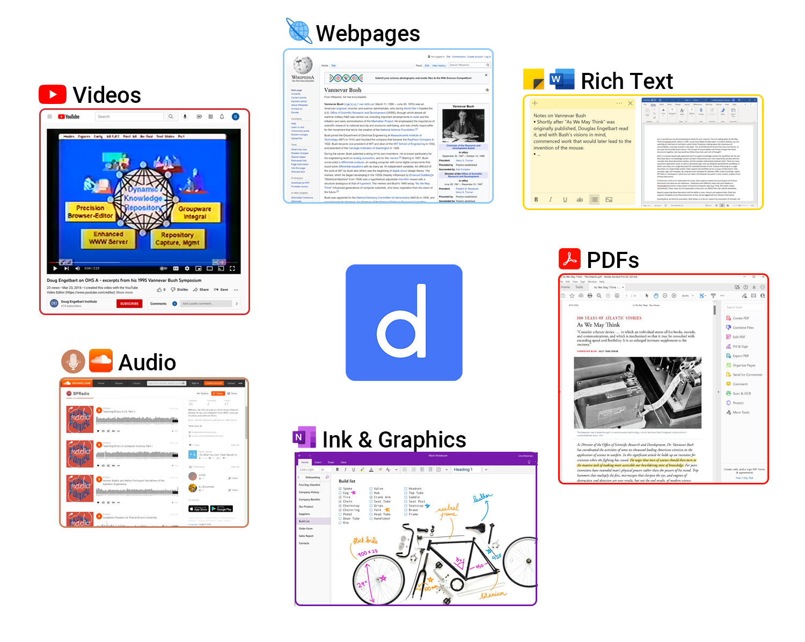
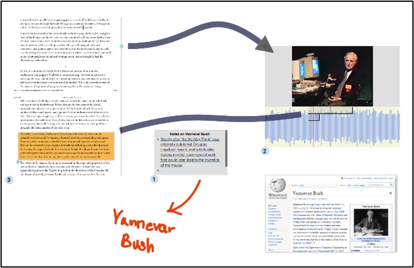

# Dash

Imagine you are annotating and reading As We May Think by Vannevar Bush, which is a PDF, so you have Adobe Acrobat open. In another desktop, you are listening to an interview in which Andy is talking about the importance of linking, a concept that Bush writes about in depth. You also remembered Andy speaking about linking from your last lecture, so you open the recorded Zoom lecture in another tab. All these documents are related, but how can we imagine, visualize and organize those relationships? 

  

Dash is a collaborative browser-based web application built to support knowledge workers for workflows like the one described above. As knowledge workers we deal with documents, but more importantly we deal with the concepts that these documents contain, and the complex relationships between them. There are many popular application suites, as well as specialized apps, that are designed specifically for workflows in which users focus on a single document for extended periods of time. Unlike these applications, as a hypermedia system, Dash supports corpuses which includes links, concepts, tags, and multimedia documents. By using the same implementation for websites, PDFs, audio recordings, videos, ink, and rich text, in Dash you can easily create and follow link between any word, region, section, or snippet of any of those documents. 

  

Dash supports spatial and visual layouts of all those documents into what we call collections.  Collections have different views that each displays its transcluded documents using a layout reminiscent of popular apps (e.g. Trello, file system viewer, spreadsheet). These views are all composable so that users can define their own specific workflows. Beyond supporting these documents and the ability to view, interact and organize them, Dash also supports metadata across these documents so they can be tagged with any relevant information and organized or sorted accordingly. Furthermore, Dash allows users to build predefined trails. Unlike other presentation apps, (eg. Powerpoint, Prezi) in Dash you can stop the linear trail at any time and continue your exploration by navigating freely and following links by association, allowing users to be trailblazers as imagined by Vannevar Bush.

Dash is built by Andries van Dam’s research group at Brown University in Providence, Rhode Island. It is available online at [browndash.com](https://browndash.com/signup). Use cases from [CS1951V](http://cs.brown.edu/courses/csci1951-v/), in which Dash was used in Fall 2021, can be found below:

### Domestic Jungle (Plant Corpus) by Mikey Abela

  <iframe src="https://www.youtube.com/embed/qE2A5PKJQe0" width="640" height="400" allow="autoplay" allowfullscreen="allowfullscreen"></iframe>

### Antoni Gaudi by Adwith Mukherjee

  <iframe src="https://youtube.com/embed/sy_YtdTpKSo" width="640" height="400" allow="autoplay" allowfullscreen="allowfullscreen"></iframe>

