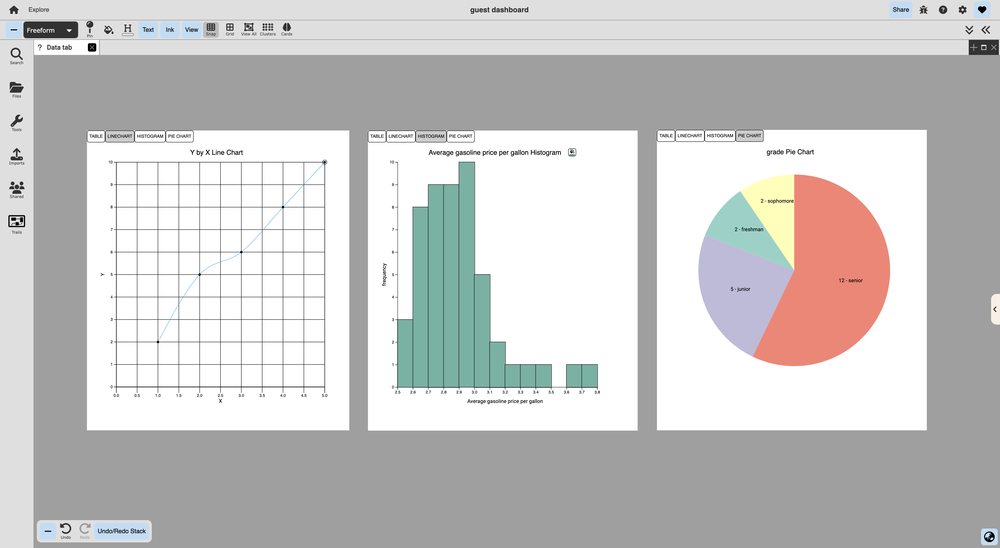
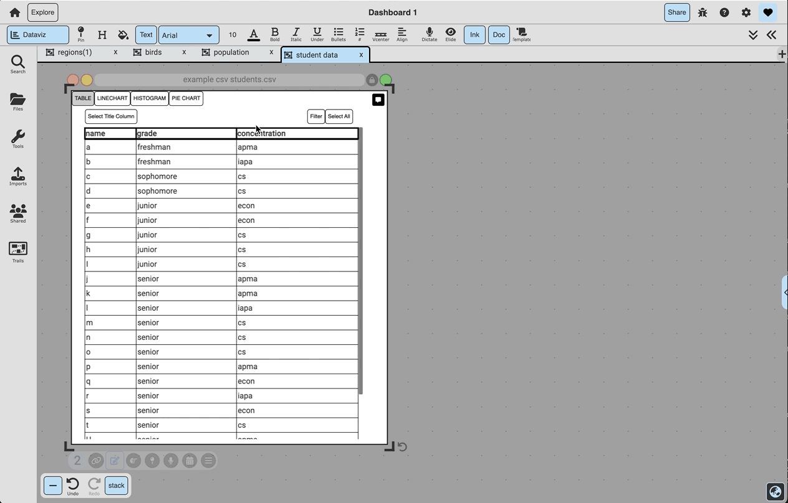
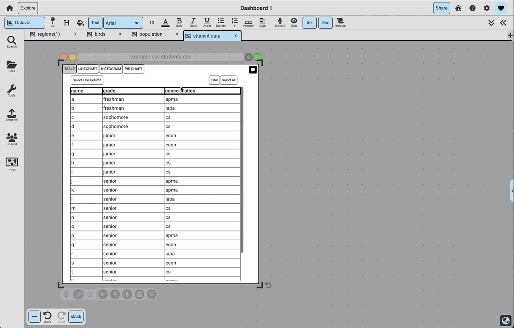
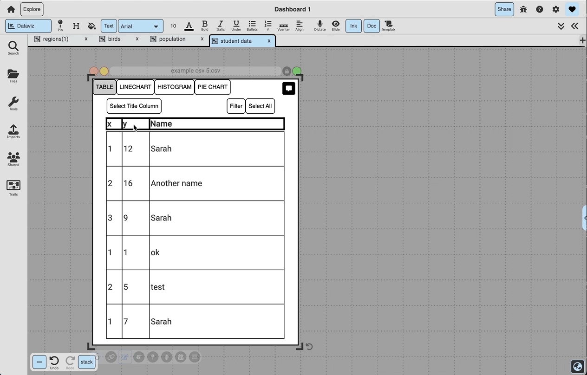
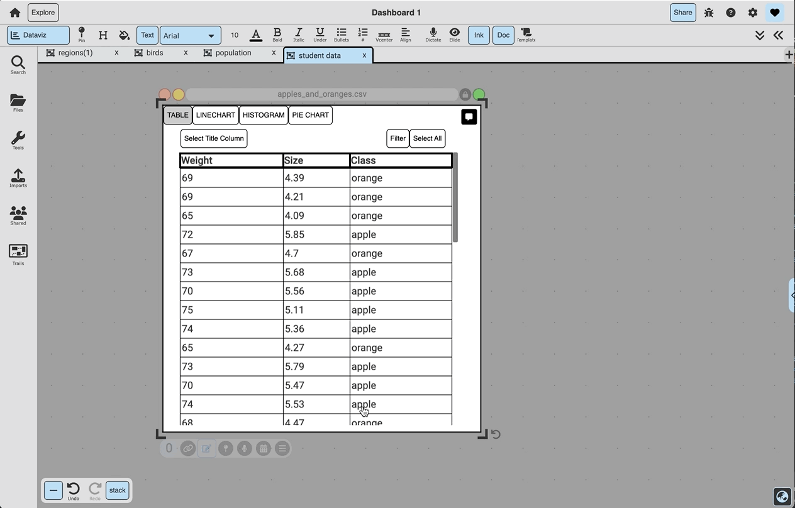
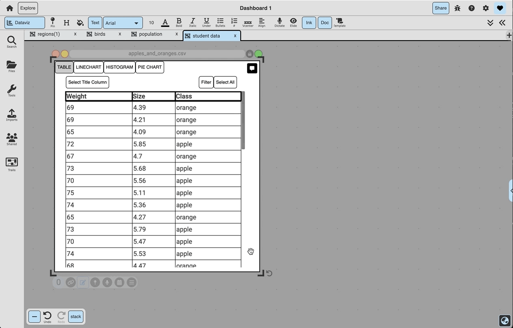
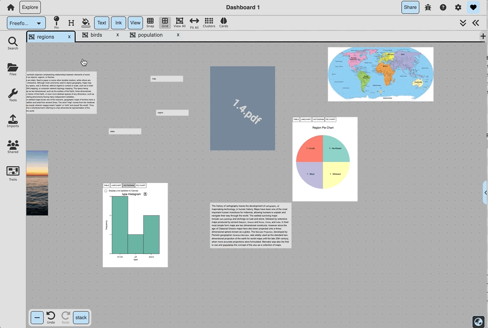
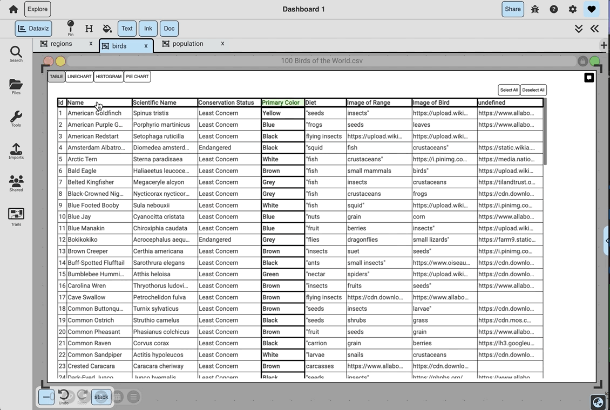
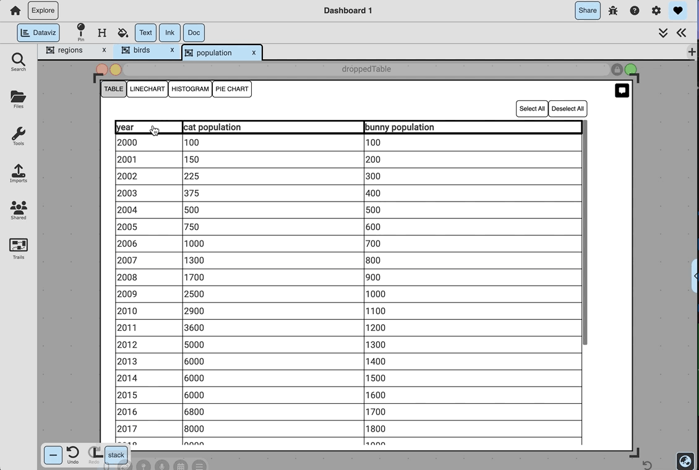

# Data Visualization

  

{: .no_toc }

  

    Table of contents
  

  {: .text-delta }
1. TOC
{:toc}

## Description: 
Data visualized in a table, line chart, histogram, or pie chart.

## Access: 
To create a DataViz box, either import / drag a CSV file into your canvas or copy a data table and use the command 'ctrl + p' to bring the data table to your canvas. See below for how to turn a schema table into a DataViz box.

## Objects & Actions: 

- ### **Basic Graphs:** 
  A data set composed of string, numbers, prices, or percents can be viewed as a table, line chart, histogram, or pie chart that can be customized by its title and colors. To create a visualization, click the title of the column you want to visualize and then select the graph type.
  {:.img}

- ### **2D Graphs:** 
  The first column selected will turn green and be the x-axis, and the second column selected will turn red and be the y-axis.
  {:.img}

- ### **Filtering:** 
  To filter the data, drag off a column of data. To select data to display on the filtered doc,

  a: click rows from the original DataViz box,
  {:.img}

  b: filter a table choosing a value or range of values in a column, or 
  {:.img}

  c: click on data in a line chart, histogram, or pie chart while the 'Select data to filter' toggle is on.
  {:.img}

- ### **Artificial Intelligence**
  Clicking the context menu's 'Analyze with AI' button will use aritificial intelligence to analyze the dataset. Initially, a general analysis will pop up, and from here, you can

  a: click 'Transfer to Text' to save this analysis as an annotation on the DataViz doc,
  {:.img}

  b: click 'Visualize' to create a line chart visualization of a correlation found in the dataset, and
  {:.img}

  c: click 'Chat with AI' to ask the artificial intelligence specific questions about your dataset,
  {:.img}

- ### **Schema Tables as Data Visualization:** 
  When in Schema view, click the 'DataViz' button on the top bar. This will create a DataViz doc that represents the schema table - then, when back in Freeform view, this can be dropped onto the canvas. When the 'Display Live Updates to Canvas' toggle is selected, this DataViz doc will change as docs are added to and deleted from the canvas, and otherwise, it will represent the static schema table that it was created from.
  {:.img}

- ### **Setting a Title Column:** 
  Click 'Select Title Column' and then select any column's title to set that column as the data's title column. This means that no matter which columns are being displayed in a graph, the title column will also be available. Alternatively, selecting a column's title while holding 'shift' will set / remove that column as the data's title.
  {:.img}

- ### **3-Column Line Charts:** 
  If three numerical columns are selected, the 'line chart' tab will display the second two columns selected (blue and red) over the first one (green).
  {:.img}