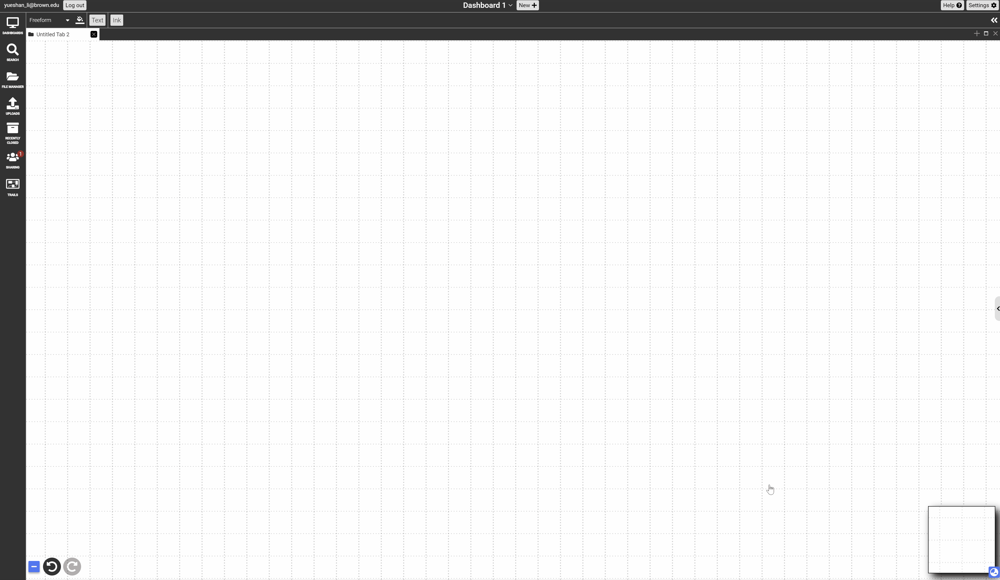

# Documents

Dash is a hypermedia system that supports the following documents in the [latest verison of Dash](https://browndash.com/login).

Everything in Dash is a document (including content primitives such as PDFs and Text notes, as well as collections of documents, thereby allowing nesting).  Documents are stored as a list of arbitrary key/value pairs, which provides a simple data model for novices while also allowing experts to manipulate metadata from a database perspective with scripts. The following sections cover basic functionalities universal to all documents. More document-specific actions please refer to the Table of Contents for documents. 

{: .no_toc }

  

    Table of contents
  

  {: .text-delta }
1. TOC
{:toc}

### Creating Documents

#### A1. Import existing documents from external sources
1. Works with PDFs, webpages, images, audio, and video
2. Importing from the internet: click and drag the desired document to the Dash tab, which will bring up the Dash workspace, and finally drop the document onto the Dash canvas
3. Importing from local files: click and drag the desired document to the Dash canvas, then drop it

#### A2. Import existing documents using the import flyout panel
1. Under the import flyout panel, single click on the topmost “Import” icon to bring up the file browser, then select all desired documents. Multiple selection can be done by left-clicking on the desired files while holding the command key (for mac). 
2. All imported documents will be displayed as a scrollable vertical stack within the rectangular box below the “Import” icon. 
3. From the rectangular box, drag and drop the desired document onto the canvas. 

#### A3. Type `:` directly on the blank canvas to bring up document menu
1. Begin typing `:` to bring up the document menu, from which you can create a document.
2. Select the type of document you want to create to make a blank instance of that document.

{:.img}

#### A4. Create an alias of an existing document
1. An alias, which is also a document itself, is a pointer back to its original document; it is typically a different perspective on the same document. This allows multiple users to have their own perspectives of the same document, or to have the same document appear in multiple collections.
2. Aliases by default have an integer in parenthesis after the title. 
Changes to the content of an alias, including editing of text or moving or resizing nested component documents of a collection on the canvas, are in effect changes to the original and are immediately reflected in all other aliases.  Other changes, such as title, size, and aspect ratio of the document  are properties of the alias and are not considered content. Therefore, they don’t affect the original document or any other aliases of it. These properties can be changed in the same ways as any other documents.
1. To create an alias, select the document then click the “create an alias” button in the context-sensitive toolbar. Alternatively, click and drag the same button, and drop it onto the desired location in the canvas to create an alias at a specified location. 

#### A5. Creating documents in other views
Click the “+ New” button in the schema and stacking views.

## Selecting Documents
<iframe src="https://drive.google.com/file/d/1P0oC6gUnRs79GWN3buydguY3kmRsZP9A/preview" width="640" height="480" allow="autoplay" allowfullscreen="allowfullscreen"></iframe>

#### B1. Single Selection
1. **Description**: selecting a single document to directly edit its contents
2. **Action**: left-click or right-click on the desired document to bring it into focus. The selected document’s border will turn blue and various editing tools will appear on the chrome (editing tools)
   * In freeform perspective, click anywhere in the blank area of the canvas to select the current collection

#### B2. Marquee Selection
1. **Description**: selecting a specified area, which can range from a part of a document to multiple documents, using the marquee tool
2. **Access**: right-click on the canvas to invoke the rectangular marquee, then drag to manipulate its size. Alternatively, right-click then press the space key to invoke the lasso marquee tool to freely draw a marquee. Finally, release the right-click to create the marquee
3. **Objects & actions**: 
* A marquee to select one or more desired documents
* A floating toolbar to where users can perform actions on the selected documents including create a collection, summarize, delete, change to text, and pin the selected region to a **[presentation trail](../features/trails.md)**
* A temporary bounding box that enables users to move and resize all selected documents at once (transforming documents)

#### B3. Shift-click selection
1. **Description**: selecting multiple documents using shift-click 
2. **Objects & actions**:
  Holding the shift key while left-clicking on multiple desired documents to select them all at once. This will create a temporary bounding box (same as the one created with marquee selection) that enables users to move and resize all selected documents

#### B4. Text Selection
1. **Description**: selecting text intext documents, PDFs, and Webpages (NOT text documents!)
2. **Objects & actions**:
* Left-click on a text of your choice, then hold & drag to continue to select the desired portion of text. Finally, release to finish the selection. The selection will be temporarily highlighted in blue. 

* Once you finish the selection, a floating toolbar will appear that allows you to highlight, annotate, or add hyperlink to the selection.

## Editing Documents

#### C1 Document Chrome
1. **Description**: set of tools around the document to access a range of functions and set various properties related to the document
2. **Access**: left-click or right-click on a document
3. **Objects & actions**:
 - Header chrome- has buttons for: 
     - Deleting the document from its current collection
     - Editable title (left-click on title)
     - Iconify (turning the document into a button displaying contents on click)
     - Open document in full screen in a new tile
     - Border chrome- has corner handles for resizing and moving the document 
 - Bottom toolbar has buttons for:
     - Creating links
     - Pinning to a presentation
     - Bringing up the context menu, which has the same contents as the right-click menu
     - Syncing with Google Docs for text documents

