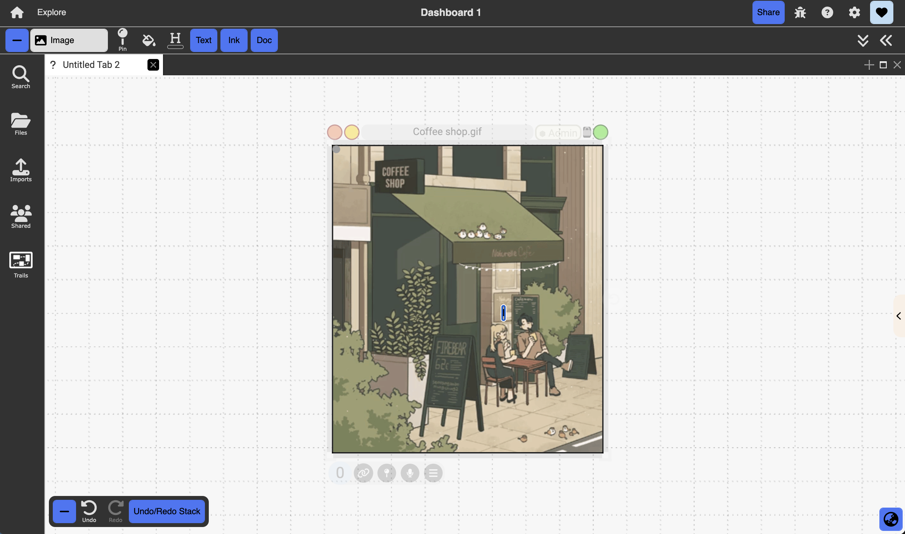

# Images

{:.img}
{: .no_toc }

  

    Table of contents
  

  {: .text-delta }
1. TOC
{:toc}

## Description:

Digital images created outside of Dash

## How to Create:

Dragged and dropped into Dash from an external source (i.e., internet, own desktop, etc)

## Objects & Actions:

- Embed marquee selections, annotations, and ink (overlay pane), acts like collection
- Make background: an image can be converted into a background image by selecting “Make Background” in the image’s right-click menu. A background image is indicated by the red lock icon at the top right corner of the image. It cannot be selected, which means it essentially becomes part of the canvas. left-clicking on the red lock icon converts the image back into a normal image.
- Rotate: users can rotate the image 90 degrees clockwise by selecting “Rotate Clockwise 90” in the right-click menu.
- Zoom into image using scroll

## Image Editor:

- Use Image Editor AI to fill in parts of the image you marked in the Image Editor
- Use the prompt box to guide the AI on how you want those parts of the image to be filled
- Click get Edits to generate edits (you will see 2 versions of the edited image + original on right side)
  {:.img}
- Returning to the dashboard will create a collection of linked images that show the iterations of generated edits
  {:.img}
