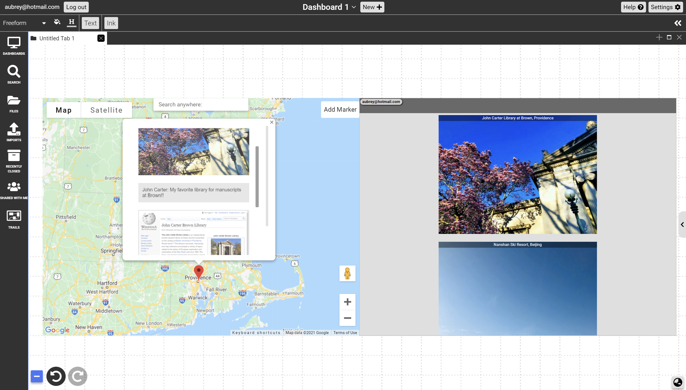

# Map in Dash

  

{: .no_toc }

  

    Table of contents
  

  {: .text-delta }
1. TOC
{:toc}

## Description: 
Map document makes geospatial linking, file storage and display possible. Users could create their own maps by importing other forms of documents with gps location into the sidebar or simply create a pin to drop on the desired location and drag and drop relevant files into the info window. 
## Access
Type colon on your canvas to invoke the node menu, under "CREATE DOCUMENT", select "MAP" to create an empty map.
## Objects & Actions
- Drag and drop images or other documents with gps data into the sidebar and they will automatically be rendered in the corresponding geolocation inside the info window of a pin on the map. (Click the pin on the map to expand info window and contents inside)
- Add marker by clicking on "Add Marker" button, then click on a desired location on map to create a new pin. 
- Click on any pin on the map to expand info window. Drag and drop other kinds of documents (regardless of whether they have geolocation or not) into the info window to form a collection of documents inside the info window.
- Same as Google Maps, drag and drop pegman onto map to open street view.

## Upcoming Functionalities
- Map auto recentering to documents during link navigation
- Linking from external documents directly to a pin, on top of existing linking behavior of linking to individual documents inside the pin.
- Drawing on top of map
- Ability to select region on the map (semi-transparent circle or square overlay) and not just specific latitude and longitude.
- More to come!

## Feedback
Map is currently a beta feature and might have unstable/unexpected behavior; Please fill in this [Google form](https://forms.gle/bZaELZDyLDVVtZEV9) to report any issues you might have! You can also use the same form to give suggestions on new functionalities you wish map to have.