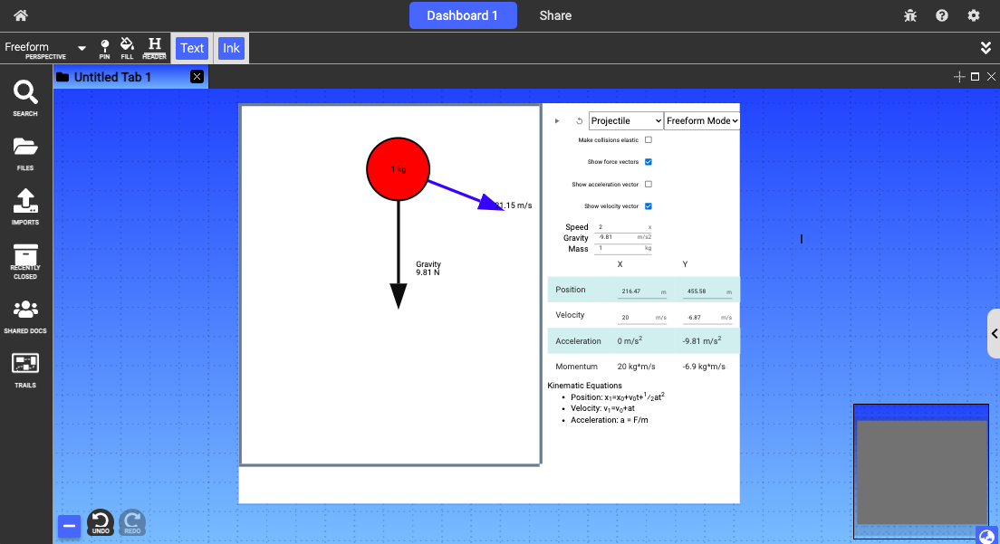

# Physics Simulations

  

{: .no_toc }

  

    Table of contents
  

  {: .text-delta }
1. TOC
{:toc}

## Description
Basic physics simulation platform with three modes: Freeform Mode, Tutorial Mode, and Review Mode.
- In Freeform Mode, users can set up basic simulations that are animated physically correctly. 
- In Tutorial Mode, users can go through step-by-step tutorials explaining how to solve particular mechanics problems for different simulations. 
- In Review Mode, users can solve example mechanics problem and animate simulations based on their answers to questions. 

## Simulation Types
- Projectiles
- Inclined planes
- Pendulums
- Springs
- Pulleys
- Weights suspended from two rods
- Weights undergoing circular motion 

## Access 
Type colon on your canvas to invoke the node menu. Under “CREATE DOCUMENT”, select “SIMULATION” to create a default simulation.

## Use
- The dropdown menus in the upper right corner of the simulation document can be used to change the simulation mode and type. 
- The input fields on the left side of the document can be used to change the simulation parameters.