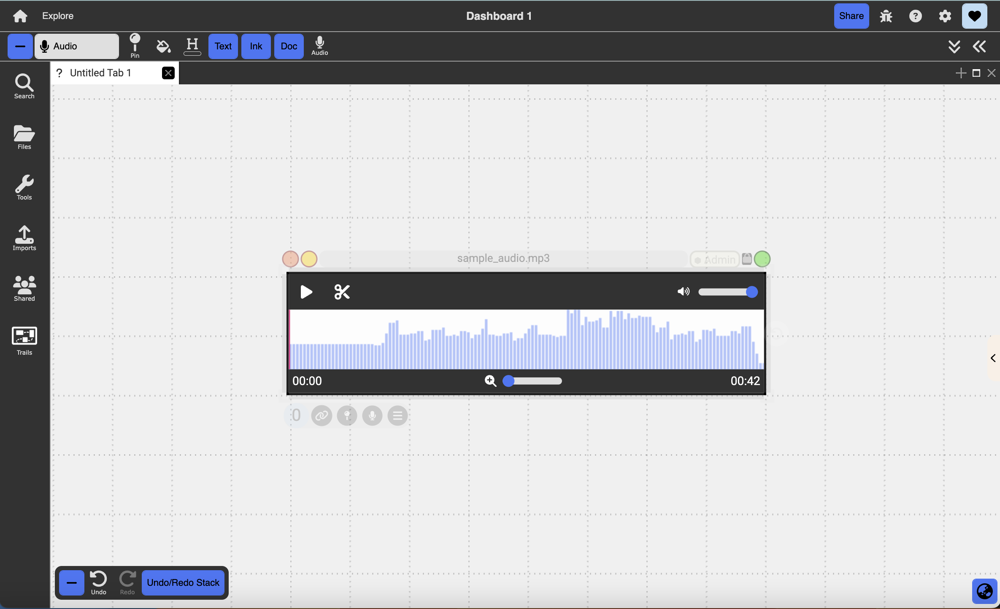
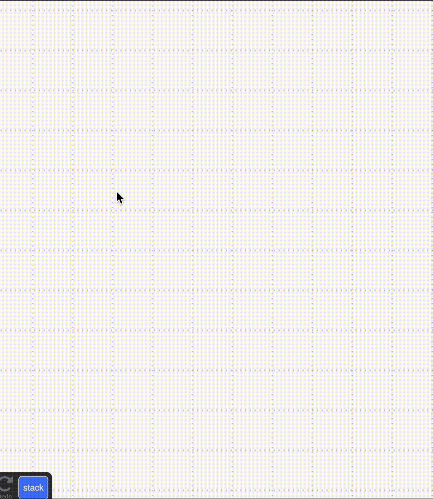
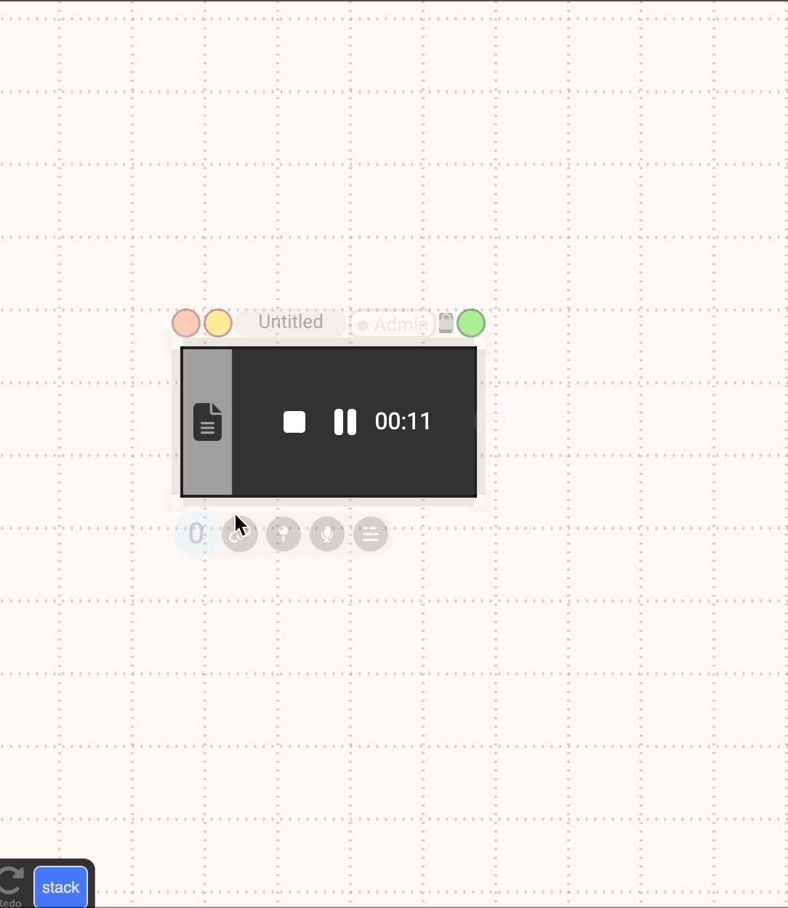
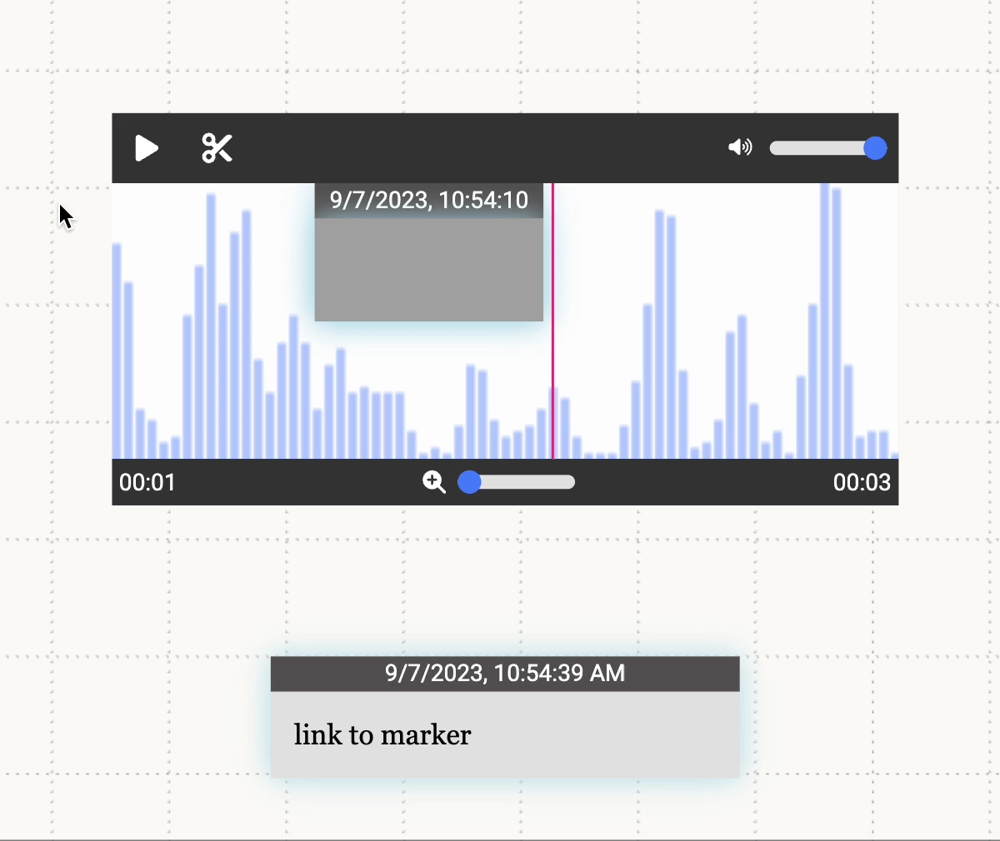
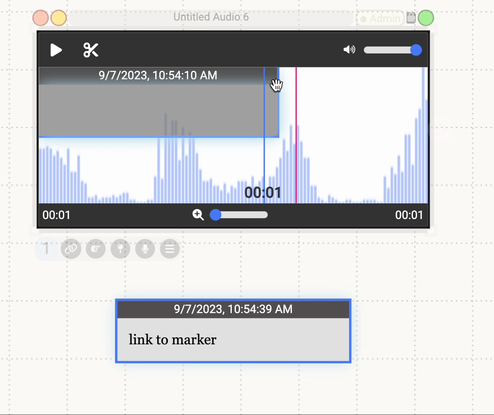
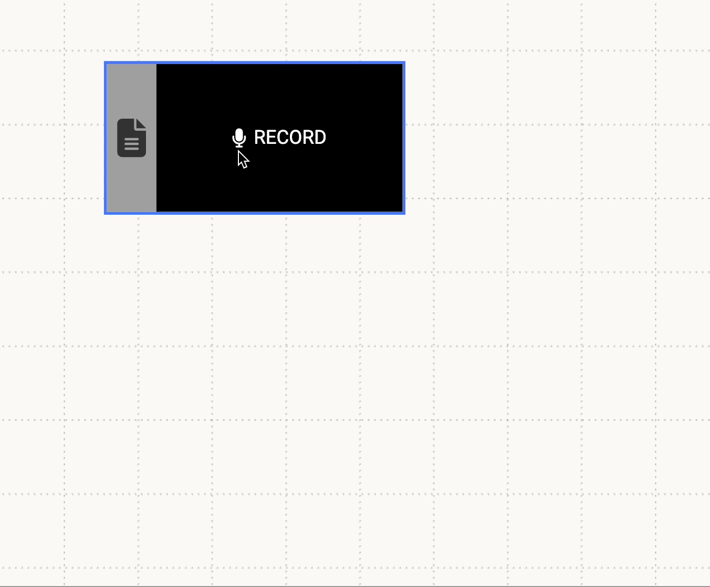

# Audio

  

{: .no_toc }

  

    Table of contents
  

  {: .text-delta }
1. TOC
{:toc}

The audio document allows the user to record and play back audio or play back imported audio files.

## Creating Audio Documents

Audio documents can be created by:

1. Using the colon menu
2. Importing an audio file from outside of Dash using the Import Menu
3. Dragging and dropping a file in from outside of Dash

## Actions

### Pre-Recording

- **Record:** Pressing the black record button on a new empty audio document begins a recording
- **Dictation:** Selecting the grey transcript button before beginning the recording creates a text document that transcribes what you say after you begin recording.

{:.img}

### During Recording

- **Pause/Play:** This button pauses and resumes the recording.
- **Stop:** This button stops the recording.
- **Dictation:** Transcription can also be started during the recording by selecting the button and then left clicking the generated text document. This creates a linked timecode in the document of the time you begin talking.
- **Linking:** Documents that are created while recording will be automatically linked to the audio recording and will have a linked label marker displayed on the timeline at the point where the document was created.

{:.img}

### Post-Recording

- **Pause/Play:** This button pauses or plays the audio document from the current time indicated by the red line on the timeline and the timestamp in the bottom left corner.
- **Trimming:** Clicking the scissor icon displays the trim controls. Dragging either of the handles at the end of the timeline will change the range the clip is being trimmed to. Double clicking either handle will reset it to the start or end of the clip. Pressing the play button while trimming will preview the trimmed range. Selecting the check icon will finish the trim and display the new altered clip. Trimming is not destructive so a shortened clip can always be lengthened again up to its original duration. Markers that are cut off by trimming a clip will be cut down to the portion that remains in the range of the new clip. If a marker is entirely out of range it will no longer play. Lengthening the clip again will increase the marker up to its initial length.

{:.img}

- **Region Markers:** To create a region marker, click on the desired starting time on the timeline and drag until the desired ending time. The region marker will play audio from the the marker's start to end. Clicking on a region marker reveals handles on both sides that allow the user to change the marker's range.
- **Label Markers:** To create a label marker, shift-click the desired time on the timeline. The label marker will playback audio from the start time of the marker to the end of the entire audio clip.

Both types of markers can be deleted by right clicking on them to display the context menu and then selecting delete.

## Right-Click Menu

The following audio-specific items can be found in the right-click menu for an audio document:

- **Hide Anchors:** This will show/hide all range and label markers from the timeline
- **Don't play when link is selected:** Toggles the ability for markers to play automatically when one of their links is selected
- **Auto play anchors onClick:** Toggles the ability for markers to play automatically when they are clicked

{:.img}

## Link Audio Documents

While recording, if the user creates any text documents, it will automatically be linked to the audio document at the creation time. While recording, the user can generate timestamps for the text document by pressing enter or pausing for 10 seconds (this can be toggled in the text document’s context menu). Linking to the audio document will generate a link at the current time. Linking to range/label markers will generate a link corresponding to their start/end time.

{:.img}
