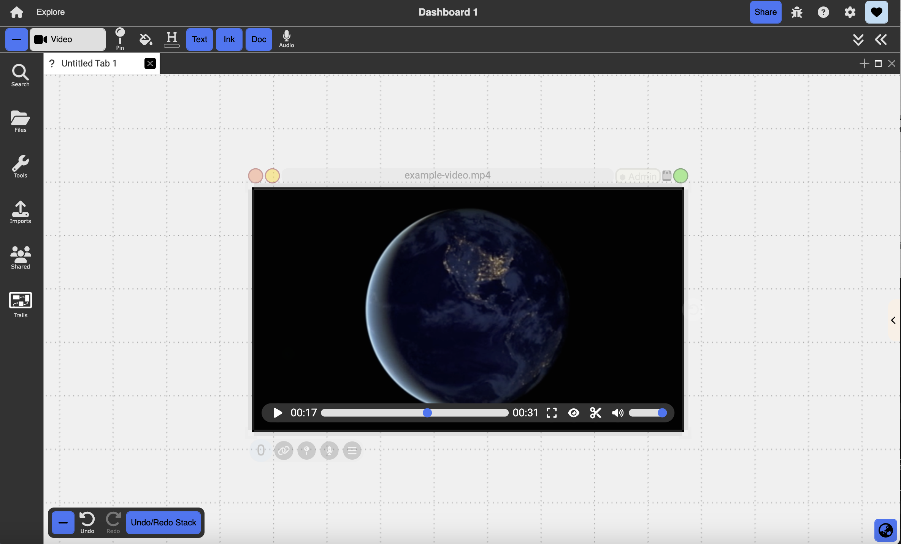

# Videos

  

{: .no_toc }

  

    Table of contents
  

  {: .text-delta }
1. TOC
{:toc}

Video documents allow users to play back video clips.

## Creating Video Documents

Video documents can be created by navigating to the Import Menu and importing a video file from outside of Dash or by dragging and dropping a file in from an external source.

## Actions

- Annotations and ink can be embedded in the overlay pane by typing or drawing directly on top of the video or dragging a document onto the video.
- You can play, pause, navigate to a specific point in time, or toggle fullscreen view using the video controls in the top right corner.
- The eye icon at the top right corner toggles the view of the audio timeline. This timeline functions similar to the timeline in an audio document allowing you to place label and region markers, though you cannot trim.

{:.img}
