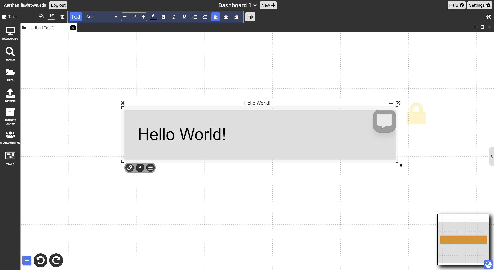
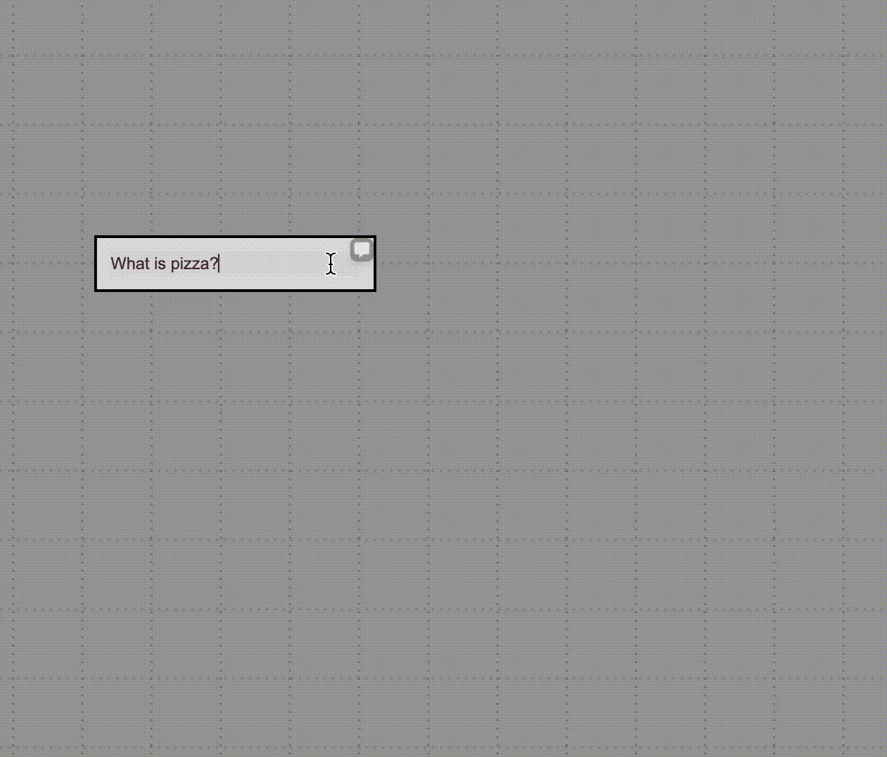

# Text Documents

{:.img}
{: .no_toc }

  

    Table of contents
  

  {: .text-delta }
1. TOC
{:toc}

## Description: rich (RTF) text documents that support various text and hypertext features

## Access:

{:.img}
Invoked by clicking anywhere on the blank canvas in freeform perspective

## Objects & Actions

- Rich text editor that appears in the context-sensitive toolbar and allows for:
  - Basic rich text editing functionality (bold, italicize, underline, etc)
  - Creating external (outside of Dash) hyperlinks
  - Adding bullets, indents, and alignment options
  - Text folding/summarizing, horizontal line, and blockquote functions
- Sidebar that allows for additional “comments” in the form of text documents:
  - Click on the `Comment` icon on the top right corner of a text document to turn on the sidebar. This allows you, or others with augmentation/edit/admin permissions to the document, to add additional “comments” in the form of text documents
  - To turn off the sidebar, click on the same small grey vertical rectangle. Note that this will not erase any existing documents in the sidebar.
  - Change style by opening context menu (3 horizontal lines, last icon under the node when the text doc is selected) and clicking Change Style
 
## Ask GPT3
{:.img}
- Type your prompt and click Ask GPT3 in the context menu

## Generate Dall-E Image
{:.img}
- Type your prompt and click Generate Dall-E Image.
- Wait for generation at bottom right of screen
- Hover over image and save to canvas

## Markdown commands

- wiki:string or phrase => display wikipedia page for entered text (terminate with carriage return)
- #tag => add hashtag metadata to document. e.g, #idea
- \>> => add a sidebar text document inline
- \`\` => create a **code snippet** block

- %% => restore default styling
- %color => changes text color styling. e.g., %green.
- %num => set font size. e.g., %10 for 10pt font
- %eq => creates an equation block for typeset math
- %alt => switch between primary and alternate text. Button on bottom right of text sets alternate text to display on hover.
- %f => create an inline footnote
- %> => create a bockquote section. Terminate with 2 carriage returns
- %( => start a section of inline elidable text. Terminate the inline text with %)
- %q => start a quoted block of text that's indented on the left and right. Terminate with %q
- %d => start a block text where the first line is indented
- %h => start a block of text that begins with a hanging indent
- %[ => left justify text
- %^ => center text
- %] => right justify text
- [:doctitle]] => hyperlink to document specified by it's title
- [[fieldname]] => display value of fieldname
- [[fieldname=value]] => assign value to fieldname of document and display it
- [[fieldname:doctitle]] => show value of fieldname from doc specified by it's title
