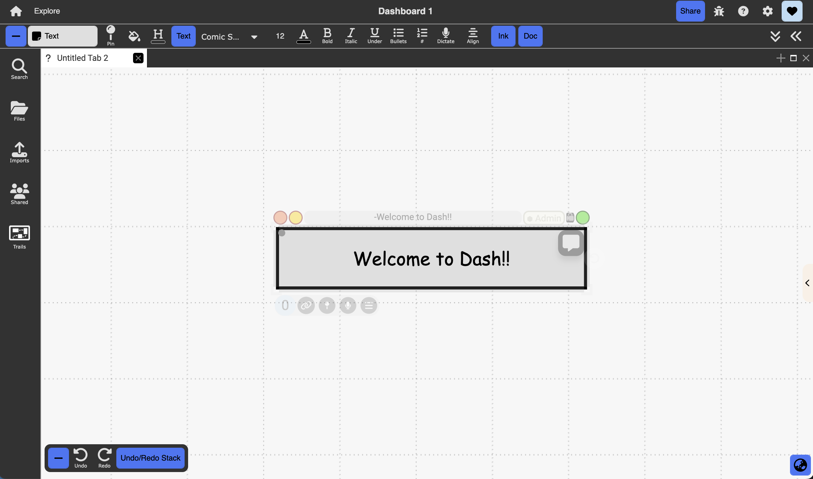

# Text Documents
<div class="img-container">
  
</div>
{: .no_toc }

<details open markdown="block">
  <summary>
    Table of contents
  </summary>
  {: .text-delta }
1. TOC
{:toc}
</details>

## Description: rich (RTF) text documents that support various text and hypertext features
## Access: 
Invoked by clicking anywhere on the blank canvas in freeform perspective

## Objects
- Rich text editor that appears in the context-sensitive toolbar and allows for:
  - Basic rich text editing functionality (bold, italicize, underline, etc)
  - Creating external (outside of Dash) hyperlinks 
  - Adding bullets, indents, and alignment options
  - Text folding/summarizing, horizontal line, and blockquote functions
- Sidebar that allows for additional “comments” in the form of text documents:
  - Click on the `Comment` icon on the top right corner of a text document to turn on the sidebar. This allows you, or others with augmentation/edit/admin permissions to the document, to add additional “comments” in the form of text documents
  - To turn off the sidebar, click on the same small grey vertical rectangle. Note that this will not erase any existing documents in the sidebar. 
- **Code snippets**. You can write code snippets by typing ` ``` `. To exit writing a code snippet use the down arrow.

