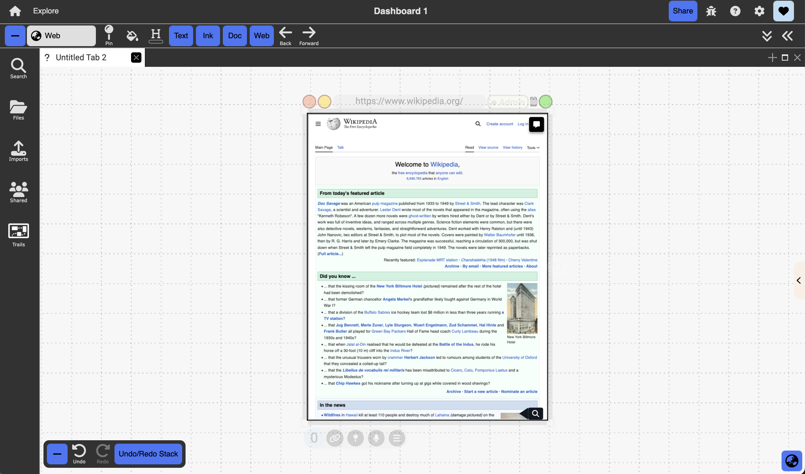

# Webpages in Dash

  

{: .no_toc }

  

    Table of contents
  

  {: .text-delta }
1. TOC
{:toc}

## Description: 
You can include embedded HTML webpages in Dash.
## Access
Dragged and dropped into Dash from an external tab. Alternatively, an empty webpage using the colon menu will open a Bing search (https://www.bing.com). Users can then enter a specific URL in the horizontal toolbar. 
## Objects & Actions
- Embed marquee selections, annotations, and ink (overlay pane) 
- Annotate and highlight text in a webpage using the same annotation sidebar as described for PDF and Text documents
- Pan, and scroll through the webpage
- Visit any embedded hyperlinks on the webpage by left-clicking on them, which will open up the target of the link in the same document frame

Note: This works well for Wikipedia pages and other webpages that are not JavaScript heavy. For other JavaScript heavy webpages, you might not be able to visit the embedded hyperlinks because of permission issues.

- Create web clippings: because of security concerns, users cannot drag in a full version of certain websites. This issue can be solved by dragging in a clipping of the website, which users can then treat as any other full websites in Dash. To do so, select the desired portion of the website, then bring it into Dash as with any other external documents. 
