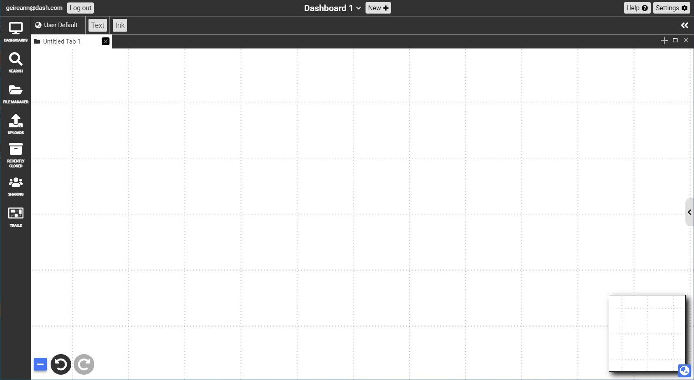
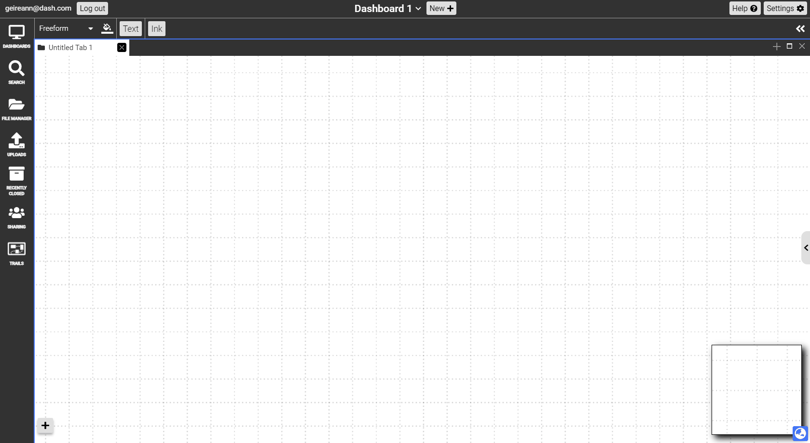
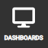
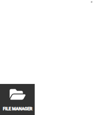
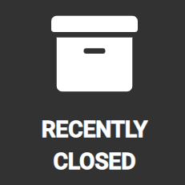
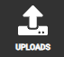
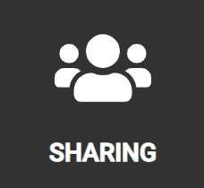
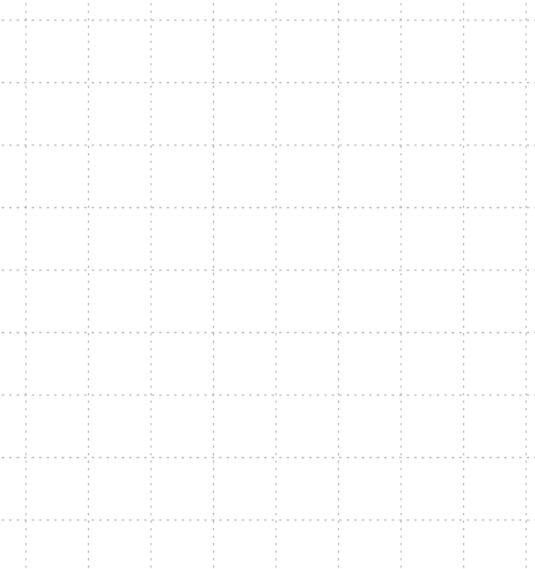

# Environment 
{: .no_toc }

  

    Table of contents
  

  {: .text-delta }
1. TOC
{:toc}

## Welcome to Dash!

<iframe src="https://drive.google.com/file/d/1hzoaU-VZBnIk1y4aOYQkbuCobunOCMd6/preview" width="640" height="480" allow="autoplay"></iframe>

When a user first opens Dash, the first view is an empty pannable freeform canvas, one of many views that dash supports. The freeform view is a pannable and zoomable freeform unbounded 2D canvas where the majority of dash's workflow takes place. It is surround by toolbars and panels which we will go over below. 

{:.img}

## Menu Panel

{:.img}
<!--  -->

Each icon in this menu has an associated sidebar panel that opens up on the left hand side of the screen. All icons above can be reordered by click and dragging the icon, then dropping it into the desired location in the menu. 

### Access
Permanently pinned on the left. Flyouts can be toggled open & closed by clicking on the specific icon, or by clicking on the grey drag handle.  The popup can be toggled open by clicking on the settings (gear) icon, and closed by clicking the “x” icon on the top right corner. 

| Icon       | Title         | Description |
|:-------------|:------------------|:------|
| {:.icon}     | **Dashboards** | A flyout panel that contains a list of the user’s active dashboards and documents. The user can right-click on the topmost “Dashboard” to invoke the right-click menu, then selecting “Create Dashboard”, in order to create a new dashboard. Each dashboard contains the collections that are within that workspace and the user can choose to expand those collections to view a list of all the items in that collection. The “On-screen Tab” section contains all your currently-opened tabs. Tabs you have closed will be moved to the “Off-screen Tab” section.   |
| {:.icon}         | **Search**   | Search for any documents within the currently selected Dashboard. The dropdown panel can be used to filter the search results by the type of document. In addition to clicking the search icon, Ctrl+F also toggles this flyout open & closed. |
| {:.icon}   | **Files** | This is your file manager where you can create folders to keep track of documents independently of your dashboard.   |
| {:.icon}| **Recently Closed** | Recently closed documents appear in this menu. They will only be deleted if you explicitly empty this list.   |
| {:.icon}        | **Imports** | This is where documents that are imported into Dash weill go.  |
| {:.icon}        | **Shared With Me** | This is where documents of dashboards that other users have shared with yu will appear. To share a document or dashboard right click and select `Share`.   |
| {:.icon}         | **Trails** | All of the trails that you have created will appearhere.   |

<!--

#### Dashboards
A flyout panel that contains a list of the user’s active dashboards and documents. The user can right-click on the topmost “Dashboard” to invoke the right-click menu, then selecting “Create Dashboard”, in order to create a new dashboard. Each dashboard contains the collections that are within that workspace and the user can choose to expand those collections to view a list of all the items in that collection. The “On-screen Tab” section contains all your currently-opened tabs. Tabs you have closed will be moved to the “Off-screen Tab” section. 
#### Search

#### File Manager

#### Recently Closed
A sidebar panel that contains all the documents that the user has recently closed or deleted.

#### Uploads
A sidebar panel that allows users to import existing files from their local machines, and view files they already have imported. 

#### Sharing
Sharing

#### Trails

-->

## Colon Menu

<!--  -->
{:.img}

## Dashboards, Tiles & Tabs

<iframe src="https://drive.google.com/file/d/1-LDsG36vURzBNGueNkX7xZVpY4Wflf5v/preview" width="640" height="480" allow="autoplay"></iframe>

### What is a Dashboard?
A particular layout of tiles is called a dashboard, and consists of one or more tabs. A user can have multiple dashboards to support different workflows. For example, one to collect a photo album, and another to take notes during class. Although documents can be linked and moved between dashboards, they are primarily designed to operate seperately. 

### What is a tab?
We display dash documents in the window manager with tabs. A tab can contain any document in dash. In your dashboard, tabs are organised into `Off-screen tabs` and `On-screen tabs`. The off `

### What is a tile?

