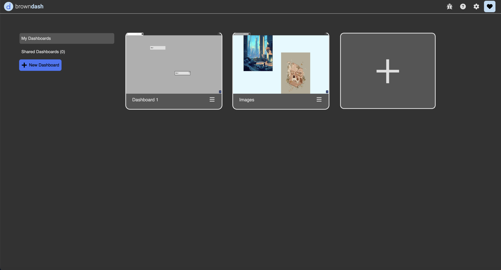

# Overall Environment

{: .no_toc }

  

    Table of contents
  

  {: .text-delta }
1. TOC
{:toc}

## Welcome to Dash!

<iframe src="https://drive.google.com/file/d/1hzoaU-VZBnIk1y4aOYQkbuCobunOCMd6/preview" width="640" height="400" allow="autoplay" allowfullscreen="allowfullscreen"></iframe>

If you haven't already, sign up for an account and get started at [browndash.com](https://browndash.com/signup).

When you first open Dash, you will see a home menu for managing your dashboards. From here you can view, delete, and share your dashboards or view dashboards shared with you by others in the "Shared Dashboards" menu. Selecting the "New Dashboard+" button or the empty dashboard with the + will create a new empty dashboard.

  

The first view in a new dashboard is an empty pannable freeform canvas, one of many views that Dash supports. The freeform view is a pannable and zoomable freeform unbounded 2D canvas where the majority of Dash's workflow takes place. It is surround by toolbars and panels which we will go over below.

  

## Menu Panel

Each icon has an associated flyout panel with additional functionality. Flyouts can be toggled open by clicking on corresponding icons.

{:.img}

### Access

Permanently pinned on the left. Flyouts can be toggled open & closed by clicking on the specific icon, or by clicking on the grey drag handle.

| Icon                                     | Title       | Description                                                                                                                                                                                                                                    |
| :--------------------------------------- | :---------- | :--------------------------------------------------------------------------------------------------------------------------------------------------------------------------------------------------------------------------------------------- |
| {:.icon}  | **Search**  | Search for any documents within the currently selected Dashboard. The dropdown panel can be used to filter the search results by the type of document. In addition to clicking the search icon, Ctrl+F also toggles this flyout open & closed. |
| {:.icon}   | **Files**   | This is your file manager where you can create folders to keep track of documents independently of your dashboard. You can also view recenly closed documents.                                                                                 |
| {:.icon}   | **Tools**   | Tools provides an alternative way to create certain types of documents, including maps, audio, and notes.                                                                                                                                      |
| {:.icon} | **Imports** | This is where documents that are imported into Dash will go.                                                                                                                                                                                   |
| {:.icon}  | **Shared**  | This is where documents of dashboards that other users have shared with you will appear. To share a document or dashboard right click and select `Share`.                                                                                      |
| {:.icon}  | **Trails**  | All of the trails that you have created will appear here.                                                                                                                                                                                      |

<!--

#### Dashboards
A flyout panel that contains a list of the user’s active dashboards and documents. The user can right-click on the topmost “Dashboard” to invoke the right-click menu, then selecting “Create Dashboard”, in order to create a new dashboard. Each dashboard contains the collections that are within that workspace and the user can choose to expand those collections to view a list of all the items in that collection. The “On-screen Tab” section contains all your currently-opened tabs. Tabs you have closed will be moved to the “Off-screen Tab” section.
#### Search

#### File Manager

#### Recently Closed
A sidebar panel that contains all the documents that the user has recently closed or deleted.

#### Uploads
A sidebar panel that allows users to import existing files from their local machines, and view files they already have imported.

#### Sharing
Sharing

#### Trails

-->

## Dashboards, Tiles & Tabs

<iframe src="https://drive.google.com/file/d/1-LDsG36vURzBNGueNkX7xZVpY4Wflf5v/preview" width="640" height="400" allow="autoplay" allowfullscreen="allowfullscreen"></iframe>

### What is a Dashboard?

A particular layout of tabs is called a dashboard. A dashboard can consist of one or more tabs. A user can have multiple dashboards to support different workflows. For example, one to collect a photo album, and another to take notes during class. Although documents can be linked and moved between dashboards, they are primarily designed to operate seperately.

#### Managing Dashboards

The home menu allows you to view and manage your dashboards. From here you can create new dashboards, share existing ones, and delete dashboards.

{:.img}

<!-- 

  

 -->

### What is a tab?

We display dash documents in the window manager with tabs. This is similar to a browser tab. A tab can contain any document in dash.

#### Creating/Deleting Tabs

You can create a tab by clicking on the plus at the top right of a tile. You can delete a tab by clicking on the x icon of each tab.

{:.img}

To open a document in a new tab, drag the document title bar to the tabs manager, and release.

From there, if you click on the tab manager region, you'll create a new tab in the current [tile](environment.md#what-is-a-tile).

{:.img}

If you want to place the new document tab in a new [tile](environment.md#what-is-a-tile), rather than clicking on the tabs manager, you can instead drag the document to the region of the freeform where you want to create a new tile.

{:.img}

To drag a document tab back into another tab, drag the document icon on the tab header back into the main tab.

{:.img}

### What is a tile?

Tiles can contain multiple tabs, you can drag and drop a tab into a tile such that you have multiple tabs in the same way that a browser like Chrome has multiple tabs.

#### Creating a Tile

To create a new tile with tabs, drag the header of an existing tab to the section of the freeform where you want to create a new tile.

{:.img}

#### Closing a Tab

To close a tab, click the x icon at the top-right of a tile.

{:.img}

Not sure where to go from here? Check out our **[Getting Started](getting-started.md)** page!
