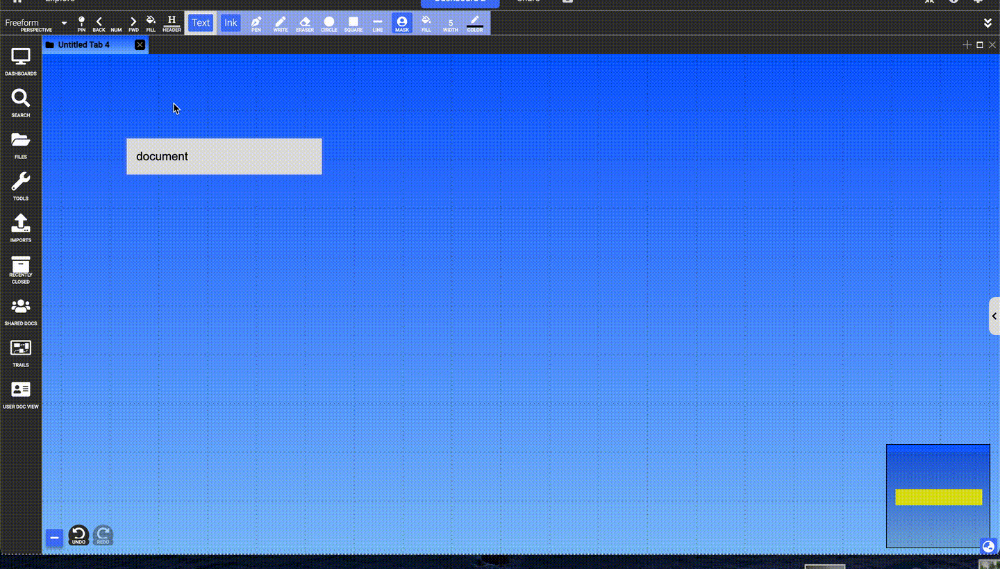
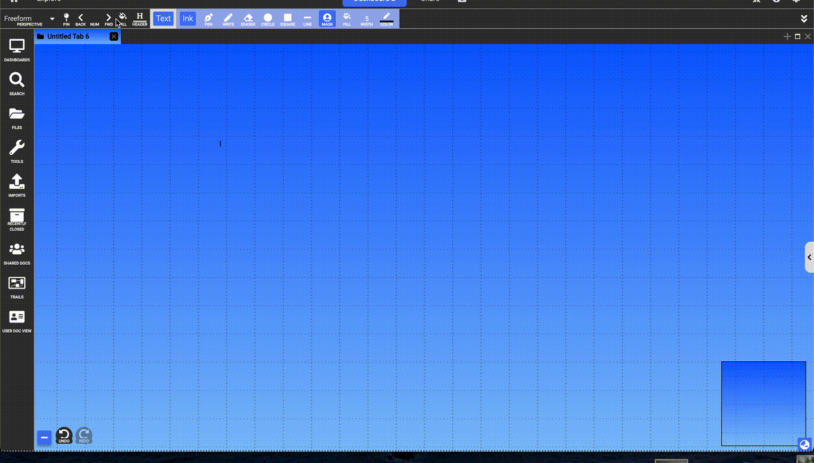

# Animations
{: .no_toc }

  

    Table of contents
  

  {: .text-delta }
1. TOC
{:toc}

**WARNING: This feature is still in development and as such is only accessible in Developer Mode (Settings > Modes > Developer). If you choose to switch into developer mode to use this feature please do so with caution knowing that there may be bugs that could result in losing some of your work.**

Dash offers tools that allow users to create frames of content that can be stepped through to create interesting animations.

Animation information can be found in the top menu bar. There are arrow buttons for stepping forward and backward through frames as well as a number in between indicating the current frame.

## Adding Frames

To begin animating, you can simply use the forward button to move to frame 1. From then onwards, any changes you make in the layout or content of documents in the selected collection will be associated with that frame. If you create a document, go to another frame, and make a change to the document, then stepping from the first frame to the next will transition between those two states of the document. Dash automatically interpolates between the modified values and transitions smoothly between them.

{:.img}

If you create or remove documents at a given frame, they will be shown or hidden from that frame onwards. This means that if you create a document at frame 3 and then go back to frame 2, it will disappear. Similarly if you closed a document at frame 3 and went back, it would reappear. If you moved ahead to frame 4, thoguh, they'd appear the same as they did in frame 3. The documents are always present, but their visibility changes based on when you added/removed them.

{:.img}

## Edit Mode

Clicking the frame number enters **Edit Mode**. In Edit Mode you can see and modify all the documents in the collection even if they are hidden at the given frame. This allows you to transition between states while the document is hidden.

{:.img}

This can be used to create effects like stacking another transition on top of the transition where the document appears/disappears, or you might use this to change the state of the document while its hidden so the transition isn't visible.

{:.img}

## Pinning to Presentations

The pin button next to the animation controls pins the open collection with the current view (read more about this on the [Trails](trails.md) page). If you do this with an animation frame active, the presentation slide will now be associated with the animation frame. This means that you can pin a collection multiple times at different frames and use your animations in a presentation.