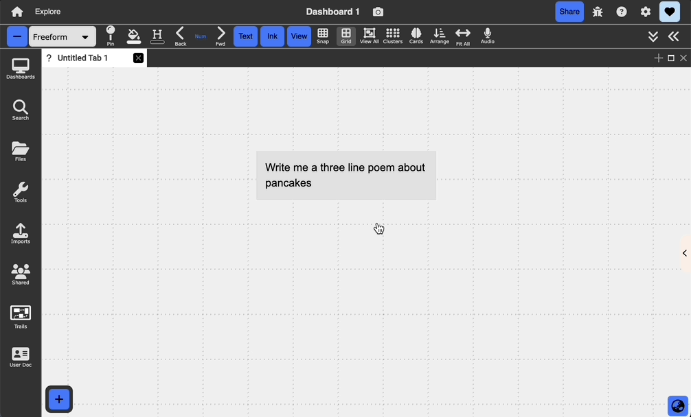
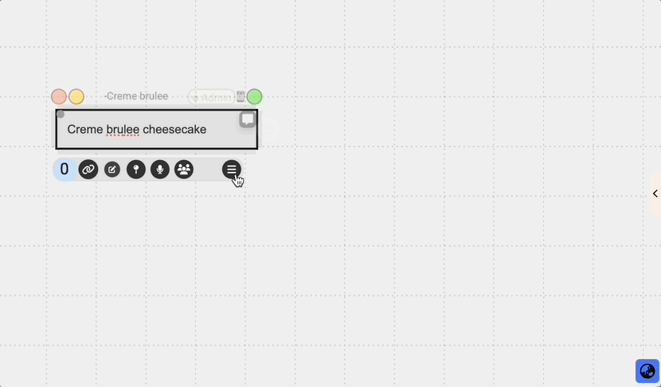

# Generative AI

{:.img}
{: .no_toc }

  

    Table of contents
  

  {: .text-delta }
1. TOC
{:toc}

## Overview

Dash supports different types of text and image generation through the OpenAI API. These features are accessible through plain text nodes, PDFs, webpages, and images.

## Text

You can invoke GPT-3 to respond to a text prompt inside of a text node by opening the context menu (three bars icon) => options => Ask GPT-3. It will type in its response in the text node containing the prompt.

{:.img}

## PDFs and Webpages

You can also summarize sections of text on both pdfs and webpages by selecting a piece of text and selecting the `Summarize with AI` icon that appears in the anchor menu. A small box will appear in the bottom right with the summarized result. You can save it as an annotation on the pdf, which will link back to the original text selection.

{:.img}

## Images

### Generation

You can generate an image from a text prompt inside of a text node by opening the context menu (three bars icon) => options => Ask GPT-3. It will type in its response in the text node containing the prompt.

{:.img}
