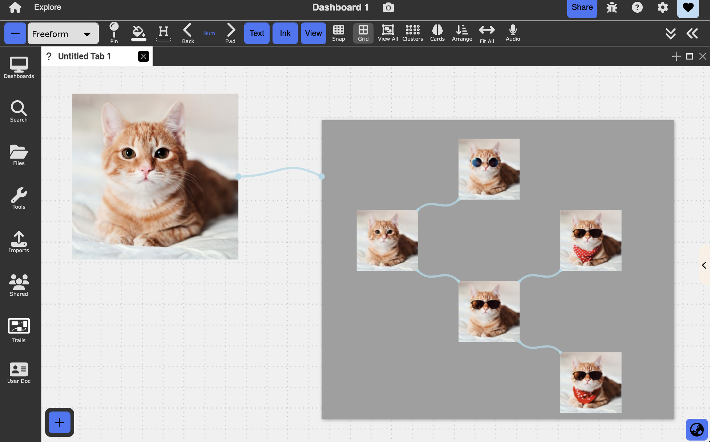
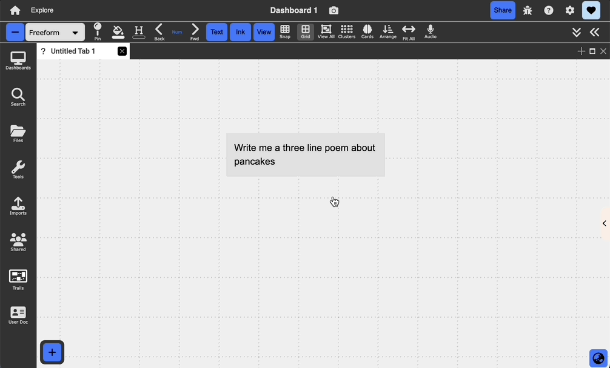
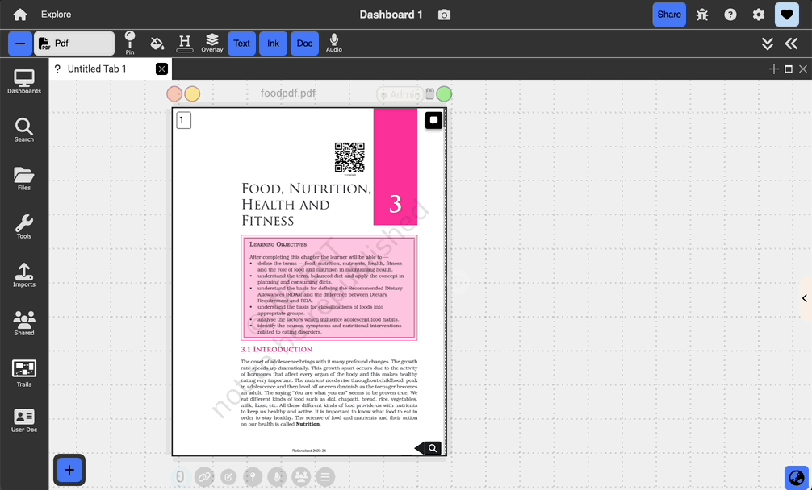
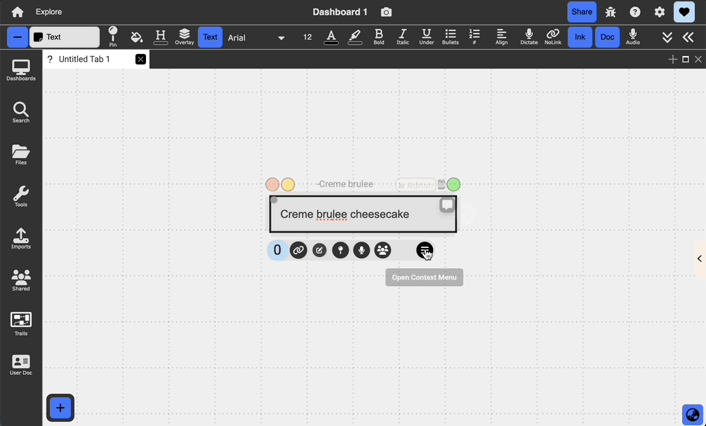
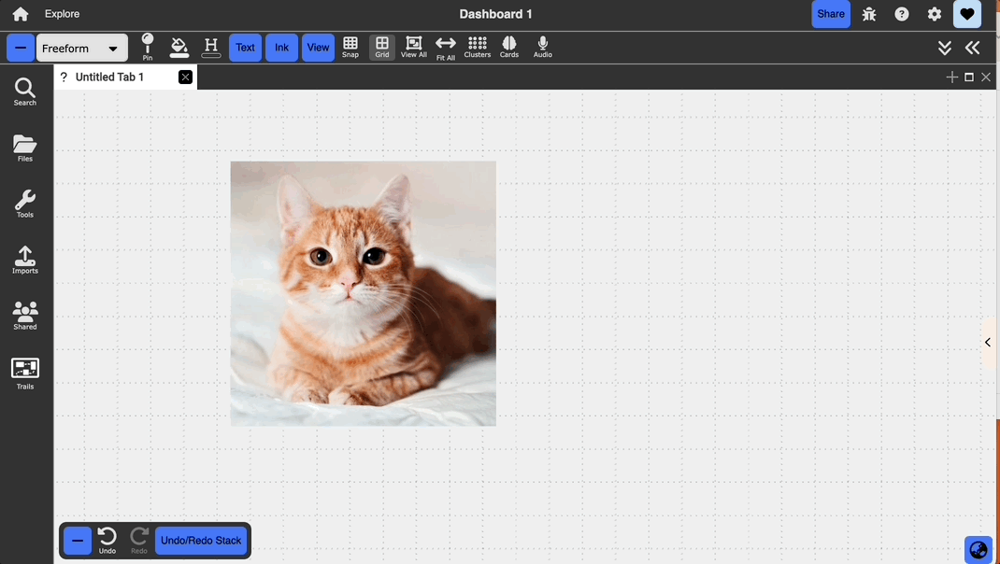
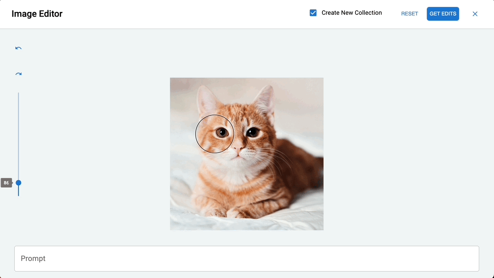
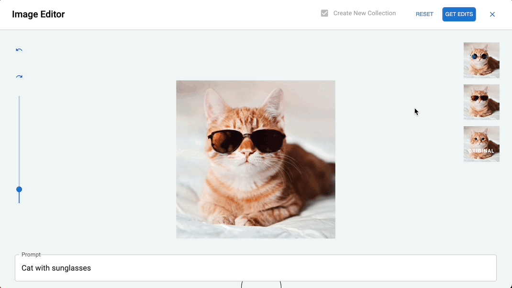

# Generative AI

{:.img}
{: .no_toc }

  

    Table of contents
  

  {: .text-delta }
1. TOC
{:toc}

## Overview

Dash supports different types of text and image generation through the OpenAI API. These features are accessible through plain text nodes, PDFs, webpages, and images.

## Text

You can invoke GPT-3 to respond to a text prompt inside of a text node by opening the context menu (three bars icon) => `Ask GPT-3`. It will type in its response in the text node containing the prompt.

{:.img}

## PDFs and Webpages

You can also summarize sections of text on both pdfs and webpages by selecting a piece of text and selecting the `Summarize with AI` icon that appears in the anchor menu. A small box will appear in the bottom right with the summarized result. You can save it as an annotation on the pdf, which will link back to the original text selection.

{:.img}

## Images

### Generation

You can generate an image from a text prompt through a text node by opening the context menu (three bars icon) => `Generate Dall-e Image`. You can preview the image once it is done generating in the bottom right box and save generations you like to the main freeform.

`Note` Images take some time to generate.

{:.img}

### Editing

You can edit images within dash to generate new visual content based on existing imagery.

#### Step 1

From the image context menu, click on Open Image Editor, which will pull up an editor view.
{:.img}

#### Step 2

Using the eraser tool, erase the part of the image you would like to fill with new content and optionally provide a prompt. Then, click `Get Edits` to generate the image edits. Variations will pop up on the right, and clicking them will draw the result to the main canvas. You can generate further edits from the results following the same process.

`Note` Images take some time to generate. Additionally, the image model may not always produce a result that aligns with the prompt. To achieve better results, provide as much context about the image in your prompt as possible, including areas of the image you are leaving as is.
{:.img}

#### Step 3

Once you close out of the editor, you'll see a tree that represents the edit version history in a new collection. You can drag that collection back into the main canvas.
{:.img}

#### Additional Editor Features

- You can undo/redo erase strokes and adjust the brush size with the controls on the left
- You can remove all erase strokes with the reset button at the top
- For the version history, you can choose to branch directly from the original image rather than creating a new collection by toggling `Create New Collection` off
