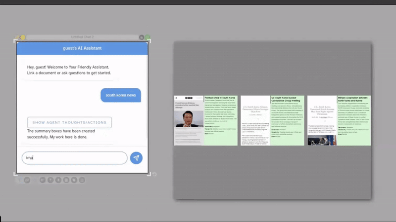

# Generative AI

{:.img}
{: .no_toc }

  

    Table of contents
  

  {: .text-delta }
1. TOC
{:toc}

## Overview

Dash's integration with the OpenAI API enables features that aid in text and image generation, sorting, and categorizing; document analysis; study tools; and more. These features are accessible through all the most common document types in Dash.

## Text

You can invoke GPT-4o to respond to a text prompt inside of a text node by opening the context menu (three bars icon) => `Ask GPT-4`. It will type in its response in the text node containing the prompt.

{:.img}

## AI Assistant

(This feature is coming to the live server soon.)

Dash's native AI assistant will conversationally analyze and summarize PDF documents and CSVs. The assistant will augment its responses with information gathered from the web and help you navigate linked documents to find what you're looking for. 

To open the assistant, drag it from the Tools tab on the left onto your dashboard.

(Coming soon...)

To use the assistant to analyze PDFs and CSVs, link a PDF or CSV document to it and type a prompt.

(Coming soon...)

The assistant can also help you search the web for relevant news articles. To use this feature, link an empty collection to the assistant box and prompt it to search the web. 

{:.img}

You can then iteratively search through conversation with the assistant.

{:.img}

## Images

### Generation

(This feature is coming to the live server soon.)

You can generate an image with the Smart Draw feature by opening it from the Ink tab at the top of the dashboard. Using Smart Draw, you can create fully customizable dash ink drawings or canvases from Adobe Firefly. 

`Note` Images take some time to generate.

{:.img}

You can also provide Adobe Firefly with a reference image drawn in Dash. To generate an image based on a reference, select the ink drawing you want to use as a reference, then open the options menu on the right (blue arrow to the right or double-arrow on the top right) and customize your generation. 

{:.img}
{:.img}

### Editing

You can edit images within dash to generate new visual content based on existing imagery.

#### Step 1

From the image context menu, click on Open Image Editor, which will pull up an editor view.
{:.img}

#### Step 2

Using the eraser tool, erase the part of the image you would like to fill with new content and optionally provide a prompt. Then, click `Get Edits` to generate the image edits. Variations will pop up on the right, and clicking them will draw the result to the main canvas. You can generate further edits from the results following the same process.

`Note` Images take some time to generate. Additionally, the image model may not always produce a result that aligns with the prompt. To achieve better results, provide as much context about the image in your prompt as possible, including areas of the image you are leaving as is.
{:.img}

#### Step 3

Once you close out of the editor, you'll see a tree that represents the edit version history in a new collection. You can drag that collection back into the main canvas.
{:.img}

#### Additional Editor Features

- You can undo/redo erase strokes and adjust the brush size with the controls on the left
- You can remove all erase strokes with the reset button at the top
- For the version history, you can choose to branch directly from the original image rather than creating a new collection by toggling `Create New Collection` off

## CSVs

(This feature is coming to the live server soon.)

You can creature documents from CSV contents with the help of AI. 

#### Step 1

To access this feature, open the context menu of a CSV document and click `Create Docs` near the top. This will open the template creator menu. 

#### Step 2

Select the columns you want to generate based on in the CSV and navigate to the field options menu (cog icon at the top right of 'Suggested Templates') to add AI-generated fields. 

#### Step 3

Click the generate button and get recommended templates for the given content. You can click on the edit button on the bottom right of each template to edit it.

{:.img}

#### Step 4

Once you're happy with your template, select all rows in the CSV you want to generate for, click on the template to select it, then navigate to the layout menu (magnifying glass icon at the top) and choose how you'd like your content displayed. When you're finished, click the 'plus' button to add the collection to Dash!

{:.img}
