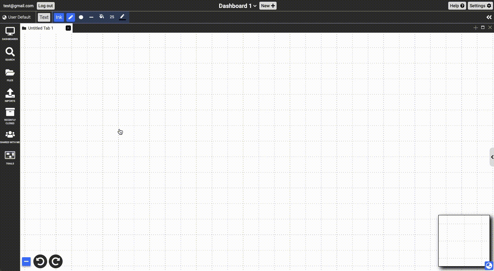

# Ink
{: .no_toc }

  

    Table of contents
  

  {: .text-delta }
1. TOC
{:toc}

Dash allows the user to draw various shapes and lines, each represented by an ink stroke. Each ink stroke is a document. Ink documents can be created using a simple pen tool or a polygon tool. Currently implemented polygons include: circles, rectangles, straight lines, and arrows. Once an ink document is created, its properties, such as stroke color, fill color, stroke width, and control points can further be modified under the Properties Panel.

## Creating Ink 

The ink tools can be found in the ink toolbar. Single-clicking on one of the tools will bring the user to ink mode only for the duration of that drawing action. Conversely, double-clicking will keep the user in ink mode until the button is clicked again.

{:.img}

## Formatting Ink

When the user opens the Properties Panel while at least one ink document is selected, the "appearance" and "transform" subpanels become visible. Changes made in the panels will only be reflected in the documents selected.

### Appearance Panel

#### Change Width
Users can augment width using the input box or the range slider.
#### Arrow Head/End 
Users can add or remove arrowheads or arrow ends by checking the corresponding box.
#### Dashed Line 
Users can toggle between solid and dashed strokes by checking the corresponding box.
#### Fill and Stroke Color
Users can change the colors of the stroke and fill using the palette that appears when the user clicks on the currently selected colors.

### Transform Panel

#### Editing Points
- Clicking on the "Edit points" button in the Transform subpanel or double-clicking the currently selected ink brings up multiple squares outlined in blue along the ink stroke. 

{:.img}

- By dragging these control points and tangent handles, users can alter the Bézier curve. When one handle point is moved, its opposite handle point will rotate the same angle in the opposite direction, resulting in synchronous movement. 

{:.img}

- To break handle tangency and allow independent movement of either handle point, the user can hold the 'Alt' or 'Option' key while dragging. Double-tapping a broken control point will snap the handles back to being parallel and re-enable synchronous movement.

{:.img}

- Control points can be deleted (pressing backspace with the point selected) or added (single clicking on the desired point on the stroke, indicated by the blue circle that appears on hover).

{:.img}

#### Lock Ratio
Users can click on the lock button to lock the dimension ratio so that they can change the width and the height of the document proportionally.
#### Rotate
Users can rotate ink documents 90 degrees by clicking on the rotate button. Alternatively, users can change the value inside the “∠:” input box.
#### Height and Width
Users can change the height and width of the ink documents by changing the values inside the  “H:” and “W:” input boxes.
#### X and Y
Users can change the x coordinate and y coordinate of the ink documents by changing the values inside the “X:” and “Y:” input boxes.

## Masks

The mask tool in the ink toolbar allows you to create a mask out of a selected ink document. This will hide everything else on the canvas and show the part that is under the ink doc. These can be useful for presentations since they can be animated or hidden and revealed to emphasize information.