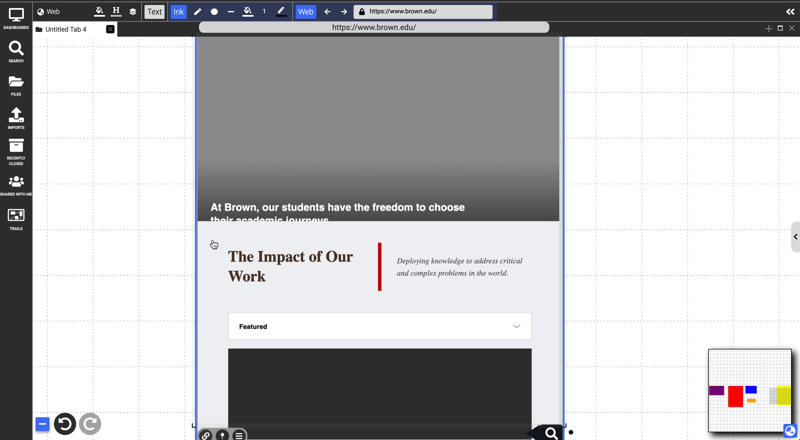
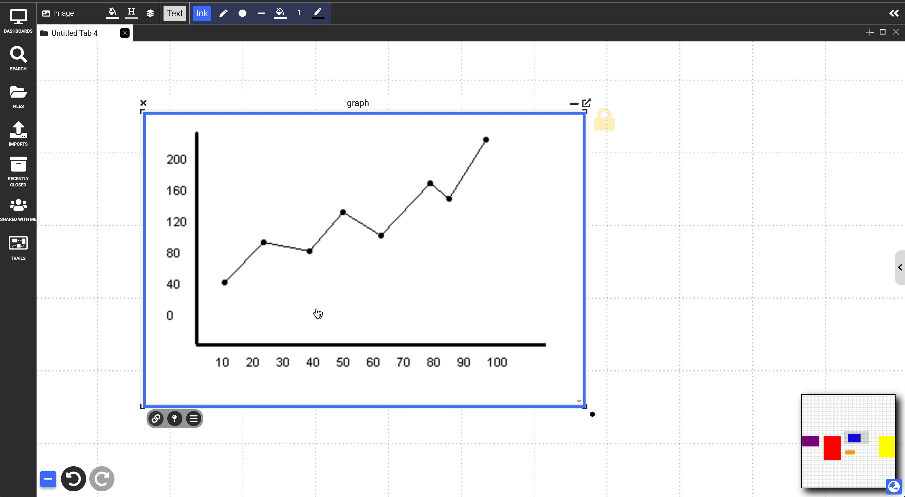
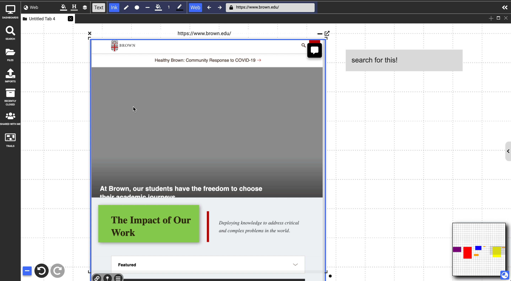

# Markup
{: .no_toc }

  

    Table of contents
  

  {: .text-delta }
1. TOC
{:toc}

Users are able to markup all documents in Dash using text annotations, ink, highlighted selections, or embedding other documents on top. 

# Marquee Selection
Clicking and dragging within an image, webpage, PDF, or video will display a rectangular marquee selection with a small menu in the bottom right corner with three options:

- **Highlight:** The highlighter icon will create a translucent overlay the size of the selection that can be transformed and linked just like any other document. The color of this highlight can be changed by first selecting a color from the dropdown next to the highlight button before selecting the highlighter icon.

{:.img}

- **Annotation:** The text bubble icon can be clicked and dragged to create an annotation note which links back to an anchor placed on the document where the selection was. Clicking this anchor created by the marquee selection by default follows the link.
    - In PDFs and webpages, the icon can be just clicked, no dragging required, which will create an annotation in the right sidebar menu which displays all annotations.

{:.img}

- **Search and link:** The magnifying glass icon brings up a small menu that allows you to search for a document in your Dash workspace. Selecting a document from this menu will create a link to the chosen document and an anchor on the document containing the marquee selection similar to annotations.

{:.img}

# Embedding
All types of documents can have all types of other documents embedded in them. This is simply done by dragging the document by the title bar and dropping it on top of another document. This can be reversed by dragging the title bar of the document out of the document in which it is embedded. When you remove an embedded document from a webpage, image, video, or PDF in which it was embedded, it will leave behind a pushpin on the containing document in that position that is now linked to the removed document.

{:.img}

# Text Highlighting
Selecting text with the cursor in text, PDF, and website documents will display the same markup menu as the one described for marquee selection above. The only difference is that this will select the specific text as the link anchor or highlight instead of creating a large rectangular selection. Linked text in a text document will display similar to a website hyperlink and clicking the text will display a preview of the linked document. Clicking this will follow the link. Colored highlights can be deleted by right clicking on the highlight and selecting the trash can icon.

{:.img}

# Ink
Ink can be used to markup documents by selecting the ink tools from the top menu bar and drawing directly on top of a document. This will create ink strokes that are embedded similar to how other documents are embedded. And just as described above, they can be removed by selecting them and dragging them out of the containing document. Note: as with other embedded documents, ink strokes may resize when removing them from the containing document.

{:.img}