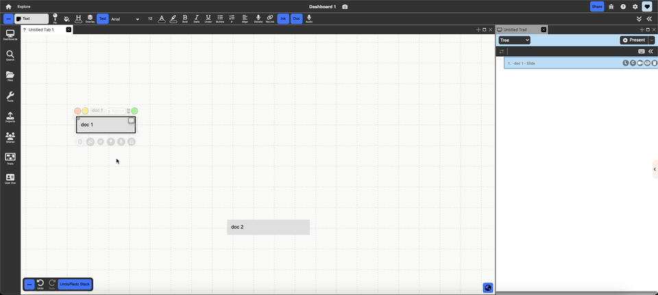
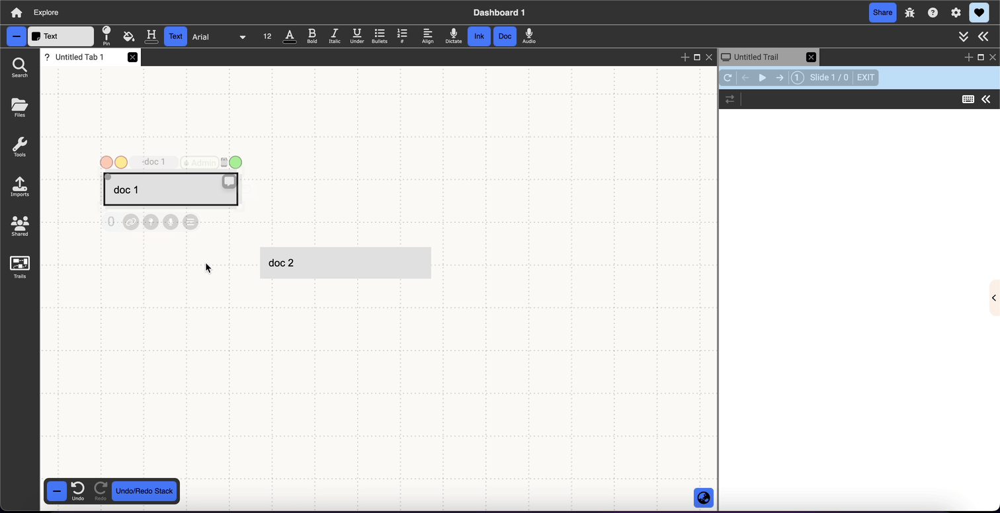

# Trails
{: .no_toc }

  

    Table of contents
  

  {: .text-delta }
1. TOC
{:toc}

"The human mind does not work that way. It operates by association. With one item in its grasp, it snaps instantly to the next that is suggested by the association of thoughts, in accordance with some intricate web of trails carried by the cells of the brain. It has other characteristics, of course; trails that are not frequently followed are prone to fade, items are not fully permanent, memory is transitory. Yet the speed of action, the intricacy of trails, the detail of mental pictures, is awe-inspiring beyond all else in nature." 
- As We May Think, Vannevar Bush (1945)

Presentation Trails allow the user to navigate through selected documents with a predefined path.

With presentation trails you can easily go from authoring mode, to presentation mode - and turn whatever you are working on into a smooth presentation. Presentation Trails work best when all of the documents are contained within Freeform collections, as it makes use of pan and zoom to navigate between documents.

## Creating and Accessing Trails

There are two ways to open up the Presentation Trails sidebar:

- 
**Menu panel:** The trails button in the lefthand menu will open up a list of your existing trails which you can open by double clicking, as well as a "New Trail" button to create a new presentation.
  
 

- 
 **Pinning a document:** Using the document decorations ‘Pin to Presentation’ button, you can pin any document to the Active Presentation. If you have not created a presentation yet, this will begin a new one and open the Trails sidebar on the right side of your workspace. If you have a previous presentation (or multiple) you closed, it will pin the document to the most recent presentation and open it up.

## Objects & Actions

### Adding documents to a trail

#### Regular pin:
To pin any document to the presentation trail simply select a document and use the ‘Pin’ button in the document decorations to add it to the presentation trail. If the user has not yet created a presentation trail, then this button will also create a new presentation trail and add that specific document as the first slide in the trail.

- {:.img}

#### Pin with view:
Pinning with view pins the canvas with the specific pan and zoom you have it set to, allowing you to show a view of multiple documents laid out on a collection. There are two places where you can pin with view:
- **Top menu bar:** this pins the canvas with the pan and zoom of the tab as you are currently viewing it
  {:.img}
- **Marquee menu:** this option appears when you right click and drag on the canvas to create a marquee selection and pins the canvas with the marquee bounds as the viewport
  {:.img}

#### Other pinning options:
Other ways to pin documents are available when hovering over the pin button in the document decorations. Each of these track different aspects of the document's state, allowing you to pin them, make changes, and then pin them again to display transitions between the document's layout or content. This is different than the default pin, where any changes made to the document after pinning are reflected in the presentation slide.

- **Pin with layout:** this pins the document saving its current layout state: xy position, width, and height
  {:.img}
- **Pin with content:** this pins the document content saving its content state such as the text of a text document, the pan and zoom of a collection, the scroll position of a PDF, etc.
  {:.img}
- **Pin with layout and content:** this saves both layout and content
  {:.img}

### Slides
Slides are used to visually represent the path that the trail would follow. Unlike the conventional Powerpoint "slide", a trails slide is just any pinned item in a presentation, whether it's a document, collection, view, etc. A single node can be pinned multiple times throughout a presentation, potentially with different content or layout aspects that change, but each of these instances is a unique slide.

{:img}

Selected slides are indicated by the blue outline and the light blue background, on each slide the user can find: 
- **Slide index:** number that appears before the slide title that indicates presentation order
- **Slide title:** in bold on the far left hand side of the slide, can be retitled by double clicking (this retitles the presentation slide NOT the pinned document)
- **L:** for slides pinned with layout, allows you to update the layout associated with the slide to the document's current state
- **C:** for slides pinned with content, allows you to update the content associated with the slide to the document's current state
- **Arrow:** groups slide with the one above it, when presenting both slides will transition in together. By default they play in parallel, but clicking the blue arrow line when grouped will switch to series and play one after the other (indicated a the black outline around the arrow)
- **Camera:** records video following your mouse movements while presenting the trail
- **Eye:** expand/minimize a preview of the slide
- **Trash:** removes the slide from the presentation (not from the collection or database)

Slides can be rearranged by dragging and dropping.

### Transitions
Selecting a slide and opening the properties menu (the gray arrow tab in the middle right edge of the screen) displays the transitions menu where you can edit many aspects of how the slide is played when in presentation mode. Multiple slides can be selected by holding down shift and clicking more slides. You can choose to apply any changes you make in the properties menu to all the slides in a presentation by clicking "Apply to all".

**Movement:** Specify the type of movement from the following options, as well as the amount of time that the movement from one document to the next will take:
- **Zoom:** Center the document in the containing collection and zoom in on it so it takes 75% of the height or width of the screen depending on what fits.
- **Pan:** Pan to display the document within view maintaining the current scale of the containing collection
- **Center:** Center the document maintaining the current scale of the containing collection
- **Jump Switch:** Switch to the zoomed in document with no transition time
- **None:** Nothing happens when this slide is the active one in the trail.

**Visibility & Duration**
- **Hide before:** When this toggle is on the document will appear hidden before it is presented in the presentation trail
- **Hide after:** When this option is toggled on after the slide is presented it will not appear in the presentation trail.
- **Lightbox:** Open the document in Lightbox view, instead of navigating to it within the collection. This can be useful for navigating Websites/PDF etc.
- **Slide duration:** Choose the amount of time that the slide will remain in focus when in Auto-present mode.

**Effects**
Choose to have an effect on the entrance of the selected document. The possible effects include: Fade In, Flip, Rotate, Bounce, and lastly Roll. You can adjust the effect direction.

### Presenting

Pressing the present button enters presentation mode which begins cycling through the slides. The presentation controls offer buttons for going from one slide to another, looping the presentation, returning to the first slide, and exiting.

Clicking the dropdown next to the present button gives you the option to start presenting with the **mini-player** which hides the presentation menu and shows you a small hovering set of controls that obstructs less of your workspace while presenting.

{:.img}

### Views
When outside of presentation mode, the presentation player above the slides is replaced with a dropdown of the available views for the trail. Each available view allows you to view the slides in a different manner, allowing for different ways of presentation to be created. 

**List:** 
The default view selected, list view is a linear way of presenting the presentation slides. As the name suggests, the slides are in a linear list, being called one after the other from the top to the bottom. Dragging a slide in this view allows the user to change the order of the trail. 

{:img}

**Tree:**
The tree view allows you to represent your slides in a tree-like structure. Slides can be dropped on top of another slide to create a system of nesting. When expanded, the children slides will play from top to bottom like in list view, but the user is also able to hide children slides by clicking to the lift of the title. Doing this will hide the children slides and during presentation, skip these hidden children. 

{:img}
