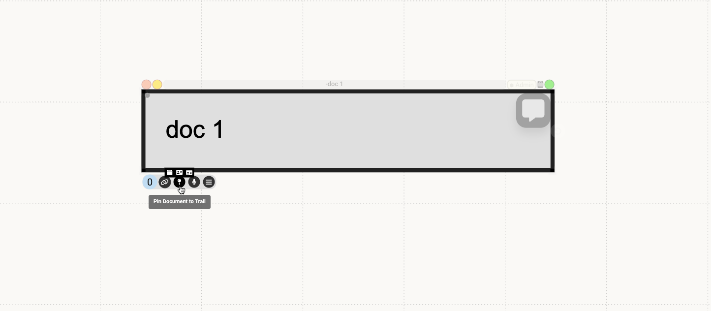
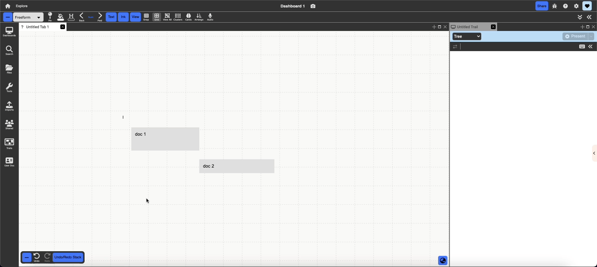

# Getting Started

{: .no_toc }

  

    Table of contents
  

  {: .text-delta }
1. TOC
{:toc}

## Before you start

If you haven't already, sign up for an account and get started at [browndash.com](https://browndash.com/signup).

For an overview of the Dash interface, check out the **[Overall Environment page](environment.md)**, which will introduce you to how to navigate and organize your Dashboards.

## Import and Content Creation

There are multiple ways that you can import into Dash. The essential ways are as follows:

- **Drag and drop**: drag any of the accepted file types from your computer or a webpage and drop it into your dashboard. This includes images, videos, audio, pdfs, and more!
  {:.img}
- **Import**: import using the import menu on the left hand side
  {:.img}
- **Begin typing `:`** to bring up the document menu, from which you can create a document. If you are in Stacking or Schema view, you can click on `+ New`, and type a colon to open the colon menu.
  {:.img}

<!-- 

  
  

 -->

## **[Documents](documents/documents.md)**

Everything in Dash is considered a document. Documents store data as arbitrary key-value pairs.

### Document Types

Dash supports several document types, each with unique capabilities. The primary types are as follows:

- **[Text](documents/text.md)**: rich (RTF) text documents that support various text and hypertext features
- **[Webpages](documents/webpage.md)**: HTML webpages from external sites
- **[PDFs](documents/pdf.md)**: PDF files created outside of Dash
- **[Temporal Media](documents/tempMedia/temporal-media.md)**: audio and video files
- **[Ink](features/ink.md)**: ink strokes drawn with the pen or polygon tool
- **[Images](documents/images.md)**: digital images from external sources

#### Nested collections

You can also created nested collections in Dash. The easiest way is through the colon menu (type : anywhere to bring it up). You can add any document to the new collection as you would to the main freeform, and zoom and pan as well.

{:.img}

You can also create a collection through right clicking and dragging on the documents you want to group into a new collection (marquee selection).

{:.img}

### Selecting Documents

There are three ways to select a document in Dash. To select a single document, simply left-click or right-click the desired document to bring it into focus.

You can select multiple documents via marquee or shift-click.

To use the marquee tool, right-click on the canvas to invoke the marquee; then, drag the bounding area to include your desired documents.

{:.img}

To use shift-click, hold down the shift key while left-clicking on multiple documents.

{:.img}

To select text in PDFs and webpages (not text documents), click and drag to highlight the desired text.

{:.img}

### Editing Documents

The following editing functions are universal to all document types:

- **Document chrome**: floating set of tools to change document properties

  - Accessed via single selection (left or right click)
    

- **Properties panel**: panel displaying document type-specific actions
  - Accessed via (A) the double arrows in the top right or (B) the single arrow on the right edge of the screen
    {:.img}
- **Right-click/Context menu**: menu displaying actions on documents
  - Accessed by right-clicking anywhere on the target document or selecting the three bars menu at the bottom of the document chrome
    {:.img}

All documents also have a context-sensitive toolbar. The toolbar contents vary depending on the document type.

### Transforming Documents

There are three main ways to transform a document: move, resize, and close.

- **Move**
  - **Selected documents**: click and drag on the title to move the document, then drop at the desired location.
  - **Unselected documents**: hover over the document to bring it into focus, then click/drag/drop to the desired location.
- **Resize**
  - **Size**: click and drag the corner handles in the border chrome.
  - **Border radius**: click and drag the small circle in the bottom right corner of the border chrome.
  <!-- - **Open in a new tab or tile**
  - Click on the rightmost “open in a new tile” icon in the header chrome to open a full view of the document in a new tile (defaults to alias). -->
- **Close**
  - **Selected documents**: click on the leftmost “x” icon in the header chrome to close the document. Alternatively, click on the trash icon under the “actions” subpanel of the properties panel to close the document.
  - **Unselected documents**: right-click anywhere in the document to bring up the right-click menu, then click “close”.

### Viewing Documents

In addition to viewing your documents in the freeform, you can also open documents in an overlay view called **Lightbox View**. To open this view, either **double-click** a document, or click on the green icon at the top-right of the document chrome.

Note that you can interact with the document in the same way you would a document in the freeform.

## **[Views](views/views.md)**

Views represent various ways to visualize a collection. Users can toggle different views through the dropdown menu in the leftmost region of the context-sensitive toolbar. Alternatively, they can open a new view as an alias by right-clicking on the current collection and selecting the desired perspective. The default view is freeform.

### **[Freeform](views/freeform.md)**

**Description**: unbounded 2D space in the form of a canvas

**Good for**:

- User-driven spatial organization and document layouts
- Visualizing document relationships, e.g., neighborhoods/clusters of related materials, nesting, and linking
- “Raw” document views to get a sense of individual layouts

### **[Schema](views/schema.md)**

**Description**: table view of documents. Each document is a row, and each column displays the contents (values) stored with the unique document key. Nested collections can be expanded in-line. The title, author, date last modified, text, and context columns are displayed by default, and users can manually add more columns with existing keys or user-defined keys.

**Good for:**

- Maintaining structured viewing and sorting of data
- Manipulating documents via key-value pairs
- Working with search functionality
- Navigating Dash an an “Excel sheet”

<!-- ### Tree

**Description**: a hierarchal outline of documents. Each item is expandable into sub-items, and sub-items range from a sub-tree of documents stored inside the current document to a live preview of the current document.

**Good for**:

- Viewing hierarchical relationships between documents
- Navigating Dash as a file directory
- Manipulating document z-indices (overlay layer) -->

### **[Stacking](views/stacking.md)**

**Description**: scrollable stack of documents.

<!-- All documents are placed in a single stack by default. If a key is specified, multiple stacks will show up side-by-side, each containing documents sharing the same value for that key. -->

**Good for**:

- Having a structured list view of all the documents of the collection while still seeing live previews of the documents
- Navigating Dash as a vertical scrolling page

<!-- ### Notetaking

**Description**: multiple scrollable stacks of documents. A multicolumn version of stacking view.

**Good for**:

- Viewing documents side by side for comparison or note-taking
- Sorting documents into categories
- Navigating Dash as a "Trello board" or table -->

<!-- ### Masonry

**Description**: 2D grid of tiles that avoids empty space. Documents automatically reflow and wrap as the aspect ratio is resized. Documents can be categorized via unique keys, which displays each category in a separate grid. Multiple categories are vertically stacked.

**Good for**:

- Avoiding vertical or horizontal padding required by grid perspectives
- Navigating Dash as a “Pinterest Board” -->

## **[Links and Anchors](features/linking.md)**

A link is a bidirectional reference from one document to another. The link itself is also a document, so we can add tags and key-value pairs to it. The same source selection (aka anchor) can link to multiple destinations, which range from an entire document to a portion of a document (eg. an annotation in a PDF, highlighted phrase in text, etc.)

For examples on linking between **parts** of documents, check out the [Annotation and Markup](getting-started.md#annotation-and-markup) section below.

### Creating links

There are two ways to create links: drag and drop or linkboard.

Drag and drop creates a 1:1 link between documents that both appear on the screen at a given time, whether in the same tab or in two different tiles.

1. Select the desired source document and navigate to its bottom toolbar.
2. Click and drag the link icon. Drop it onto the desired destination document.

Once a document is created, two messages will appear: one confirming successful link creation, and another prompting users for an optional link label. Labels may be modified later thorugh the link menu. The document will then display a number displaying the number of links it contains.

{:.img}

Linkboards function as a clipboard: they "copy" source documents to the linkboard until they are cleared or linked to another source. This is convenient for creating multiple links with the same source and/or creating links while maintaining another workflow.

1. Select the desired source document and navigate to its bottom toolbar.
2. Left-click the link icon.
   1. A popup bar will display at the bottom of the screen with two options: one to toggle displaying or hiding optional link labels, and one to exit linking mode.
3. Complete the link by clicking on the desired target document and selecting the second link icon that appears in the bottom menu.

{:.img}

### Following links

Once a link is created, a blue dot will appear in the document's bottom left corner both when you hover over the document and click on the document. The number represents the number of links on the document. Clicking on the dot displays all links in a list; hovering over each list item shows a preview of the document it links to.

Selecting an item from the list will follow the link from source to destination.

The default following behavior is to pan the freeform so that the destination document is in view (if it isn't already) and highlight it in orange. You can customize the link following behavior and more in the [link editing](getting-started.md#editing-links) section of the properties menu.

{:.img}

If you toggle the hand pointing right icon on, clicking on the document will now follow the first linked document.

{:.img}

### Editing links

Once a link is created, a blue dot will appear in the document's bottom left corner both when you hover over the document and click on the document. The number represents the number of links on the document. Clicking on the dot displays all links in a list; hovering over each list item shows a preview of the document it links to. Clicking the pencil icon to the left will open up the properties pane on the right, where you can edit the link.

{:.img}

In the link editing section of the properties pane, you can add a link relationship and description, toggle the display of the link line, control the link following animation behavior, and more.

{:.img}

<!-- The link editing options are as follows:

- Show/hide anchor: renders a trail visually representing the link and its anchors. Anchors are indicated as colored dots on the bottom right of the document; links are shown as a dotted line.
- Show/hide link: toggles the dotted line created by the show/hide anchor tool above.
  {:.img}
- Move/freeze dot: toggles the user's ability to reposition anchor dots.
- Edit link: opens a modal for editing link descriptions, relationships, and follow behavior.
- Delete link: removes the selected link. -->

In Dash, you can also create links between **parts of documents**. Read the [Annotation and Markup](getting-started.md#annotation-and-markup) section below for examples of how to do this!

## **[Annotation and Markup](features/markup.md)**

Media documents (eg. PDFs, webpages, images, videos, audio) currently support user annotations and markups. Note that certains ways of annotating provide a way to link between **parts** of documents rather than whole documents.

There are several ways to add annotations:

- `Top-right Icon` Click on the annotation icon at the top right of a document to open the annotation sidebar.

  {:.img}

- `Highlight` For text, pdfs, and webpages, you can highlight a piece of text and select the annotation icon that appears. This also creates a `link` between the annotation and selected text.

  {:.img}

- `Search` After highlighting, you can also click the search icon to search for a document to link to. This also creates a `link` between the annotation and selected text.

  {:.img}

- `Marquee` Clicking (left-click) and dragging within an image, webpage, PDF, or video will create a rectangular marquee selection, allowing you to highlight the selected region and create an annotation associated with it. For webpages and pdfs, you can simply click the annotation icon to add an annotation. For other media types, you'll need to drag the annotation icon to another part of the document or freeform to create the annotation. This also creates a `link` between the annotation and marquee selection.

  {:.img}

  {:.img}

- `Temporal media` On audio and video documents, you can drag a section of the timeline to create an annotation on that time range. You can link other documents to the annotation, and following that link will play that region of the audio or video.

  {:.img}

- `Embed` Type directly on a media document (This can be done on images, pdfs, webpages, and videos).

  {:.img}

- `Ink` Draw ink strokes directly on a document.

  {:.img}

<!-- Media documents (eg. PDFs, webpages, images, videos, audio) currently support user annotations and markups. There are four types of annotations:

### Text

**Description**: in-line text annotations.

**Access**:

- Click anywhere on the media document, then start typing
- On PDFs: highlight the desired PDF text, then use the floating toolbar to create an annotation. Alternatively, drag the highlighted text to an existing annotation.

{:.img}

### Ink

**Description**: embedded ink strokes.

**Access**:

- Draw anywhere on the media document.

### Marquee selection (collection)

**Description**: an empty, semi-transparent collection that serves as an anchor for links as well as a “highlight” for a desired region.

**Access**:

- Perform a marquee selection on the desired region, then select "Create a Collection" on the floating toolbar.

{:.img}

### Highlight

**Description**: highlights of PDF and website text portions.

**Access**:

- Select the desired portion of the text. Right-click the highlighted region and use the floating toolbar to edit the highlight.

### Pushpin

**Description**: toggles the visibility of user annotations.

**Access**:

- By default, dragging an annotation outside of its parent document will leave a pushpin at the original location the annotation was created. -->

## **[Presentation Trails](features/trails.md)**

Presentation trails allow the user to navigate through documents in a predefined path, similar to a Prezi or Slides presentation, but with added, flexible functionality. You can pin any document to a presentation trail.

### Creating a Trail

There are two ways to create a trail:

1. Creating a new trail from the trails panel on the left sidebar.

{:.img}

2. Pinning a document or a view.

{:.img}

After creating a trail, a new tab will open up displaying the slides of the trail. You can click on each slide to view and transition between the different views and documents you've pinned.

{:.img}

### Adding documents to a trail

#### Regular pin:

To pin any document to the presentation trail simply select a document and use the ‘Pin’ button in the document decorations to add it to the presentation trail. If the user has not yet created a presentation trail, then this button will also create a new presentation trail and add that specific document as the first slide in the trail.

#### Pin with view:

Pinning with view pins the canvas with the specific pan and zoom you have it set to, allowing you to show a view of multiple documents laid out on a collection. There are two places where you can pin with view:

- **Top menu bar:** this pins the canvas with the pan and zoom of the tab as you are currently viewing it
  {:.img}
- **Marquee menu:** this option appears when you right click and drag on the canvas to create a marquee selection and pins the canvas with the marquee bounds as the viewport
  {:.img}

You can customize how the document should be pinned by hovering over the pin icon, allowing you to pin documents while preserving their layout and content. Check out the details on this [here](features/trails.md#other-pinning-options).

#### Reorganizing slides

To reorganize the slides in your trail, simply drag and drop the slides to the order you want.

{:.img}

### Customization

Clicking the double arrows in the trail tab wil open up a pane where you can customize the transition behavior of each slide.

{:.img}

### Presenting a trail

Now that you've created a trail, you can walk through it by entering presention mode!

Click on the present button in the top right to enter present mode. You can use the arrows to navigate between slides, or select the play icon to autoplay the presentation.

{:.img}

Alternatively, you can select the mini-player option from the dropdown to present with a mini-player instead.

{:.img}

## **[Collaboration](features/collaboration.md)**

Dash documents can be shared with individuals, groups of individuals, or a combination of both. Users may assign four types of document access rights:

**1. Admin**: users can add, remove, edit, and change others' access rights to the document.

**2. Can Edit**: users can add, remove, and edit the contents of a document. However, they may not change others' access rights.

**3. Can Augment**: users can annotate and add other documents, but they cannot edit or remove the document.

**4. Not Shared**: users have no access and cannot add, edit, remove, or view the document.

**To create a group**:

1. Click on the settings button on the top right in the menu and select the Modes submenu. Click on the Manage Groups Button.
2. Click on the Create Group button to open the group creation menu.
3. Enter a group name and add group members (or leave that field empty for an empty group). Click on Create to create the group.
4. Click on the blue _i_ to view or edit group members. You can add or remove members or delete the group from this menu.

{:.img}

Unsure of how to navigate the overall Dash interface? Check out the **[Overall Environment page](environment.md)**.
