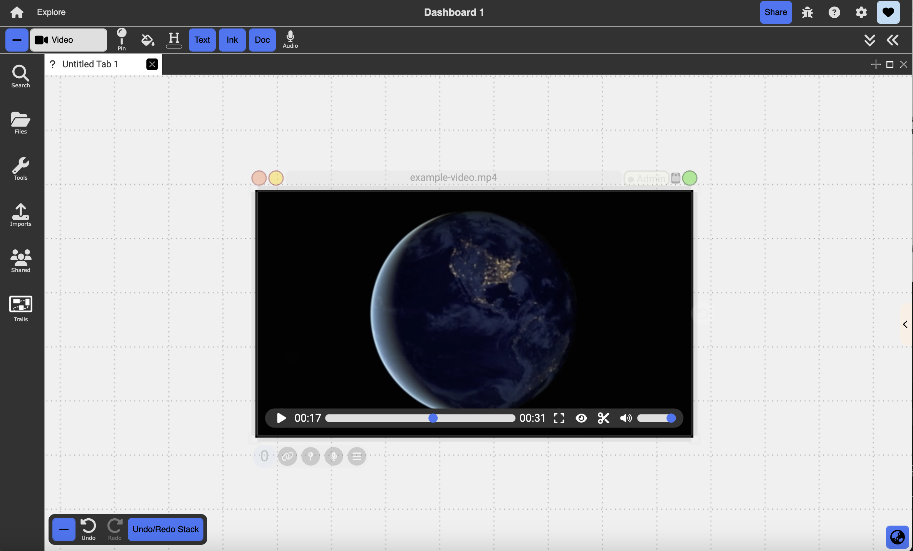

# Videos

  

  

    Table of contents
  

  {: .text-delta }
1. TOC
{:toc}

This is a collection of all of the videos included in this documentation. 

## Welcome to Dash!

An introduction to the overall environment. To find out more about the overall environment you can go [here](/environment).

<iframe src="https://drive.google.com/file/d/1hzoaU-VZBnIk1y4aOYQkbuCobunOCMd6/preview" width="640" height="400" allow="autoplay" allowfullscreen="allowfullscreen"></iframe>

## Dashboards, Tiles & Tabs

An explenation of dashboards, tiles & tabs and what they mean in dash. There is a more detailed explanation of dashboards in [here](/environment/#dashboards-tiles--tabs)

<iframe src="https://drive.google.com/file/d/1-LDsG36vURzBNGueNkX7xZVpY4Wflf5v/preview" width="640" height="400" allow="autoplay" allowfullscreen="allowfullscreen"></iframe>

## Creating and Importing Documents

How to create and import documents into Dash.

<iframe src="https://drive.google.com/file/d/1ssG_zGsx0bTz6yvmChZW-ezzQfM1inQm/preview" width="640" height="400" allow="autoplay" allowfullscreen="allowfullscreen"></iframe>

## Selecting Documents

How to select documents in Dash. 

<iframe src="https://drive.google.com/file/d/1P0oC6gUnRs79GWN3buydguY3kmRsZP9A/preview" width="640" height="400" allow="autoplay" allowfullscreen="allowfullscreen"></iframe>

## Editing Documents

How to edit documents in Dash. 

<iframe src="https://drive.google.com/file/d/1lyXau8RXxV2BZN22qymJwJvIgcmCsRle/preview" width="640" height="400" allow="autoplay" allowfullscreen="allowfullscreen"></iframe>

## Types of Documents

The different types of documents in Dash.

<iframe src="https://drive.google.com/file/d/1paYEDlKFfr_8fLEEjrXtY6tB5CJMCz0T/preview" width="640" height="400" allow="autoplay" allowfullscreen="allowfullscreen"></iframe>

## Views

An introduction to the 3 basic views available in Dash. 

<iframe src="https://drive.google.com/file/d/1aepMLRz9_oGsYTG1ZY8n1uJDqL8bX3IX/preview" width="640" height="400" allow="autoplay" allowfullscreen="allowfullscreen"></iframe>

## Embedding Documents

How to add additional documents within other documents.

<iframe src="https://drive.google.com/file/d/1ZF8gPqxPnXMmBHabPQs5DjGiJ0YspUMY/preview" width="640" height="400" allow="autoplay" allowfullscreen="allowfullscreen"></iframe>

## Search

How to search for any document within your dashboard. 

<iframe src="https://drive.google.com/file/d/1ii3ri9fx2R8fpqKaZMdC5pg9herw_te3/preview" width="640" height="400" allow="autoplay" allowfullscreen="allowfullscreen"></iframe>

## Filters

`Developer Mode`

<iframe src="https://drive.google.com/file/d/1HzBTaIbkINMDw70ha1-_upiHNsQOeWYE/preview" width="640" height="400" allow="autoplay" allowfullscreen="allowfullscreen"></iframe>

