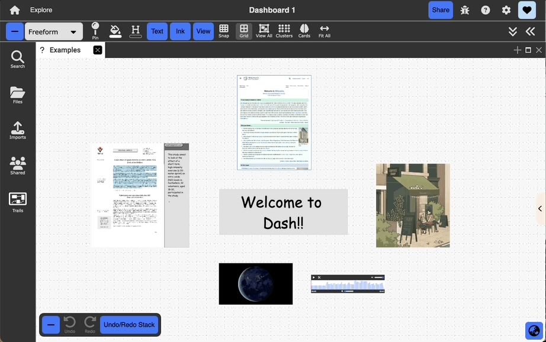

# Freeform View

  

{: .no_toc }

  

    Table of contents
  

  {: .text-delta }
1. TOC
{:toc}

## Description:

Unbounded 2D space in the form of a canvas. This is Dash's primary view

## Good for:

User-driven spatial organization and layout of documents
Visualizing document relationships, e.g., neighborhoods/clusters of related materials, nesting, and linking
Gaining “raw” views of documents to get a sense of their individual layouts
