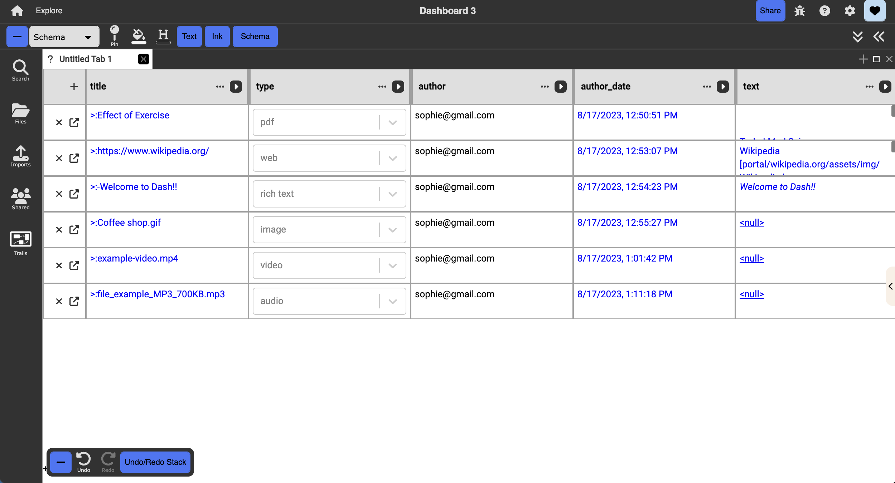

# Schema View

  

{: .no_toc }

  

    Table of contents
  

  {: .text-delta }
1. TOC
{:toc}

## Description:

Displays each document as a row, where each column displays the contents (values) stored with the specific key for that document. Nested collections can be expanded in-line. The title, author, date last modified, text, and context columns are displayed by default, and users can manually add more columns with existing keys or user-defined keys.

## Good for:

Manipulating documents via key-value pairs and maintaining structured viewing and sorting of data
Working with search
Navigating Dash an an “Excel sheet”

## Objects & actions:

- Open a live preview of the selected document on the side in a new tile, by toggling the “show preview” button in the context-sensitive toolbar
- Add new columns by clicking on the “+” button next to the right-most column. The column title itself is a key and each cell is a value. Keys can include existing keys intrinsic to the document, or new user-defined keys. can also have different types including string (text), number, checkbox, and documents.
  - Adding a column with an existing key is a viewing operation, while adding a column with a new key is an edit operation that adds more information to the document.
- Edit existing columns (keys) by left-clicking on the small circular button next to the column title, which will invoke a drop-down menu that allows users to change the column’s title, type, sorting order, and background color.
- Edit existing cells (values) by left-clicking on the desired cell, then typing in the desired value. If the value is a string, put quotation marks around the value.
- Sort each column in ascending or descending order of its values, by toggling the arrow buttons beside each column title or by selecting the desired order in the column’s dropdown menu invoked by clicking the small circular button next to the column title
