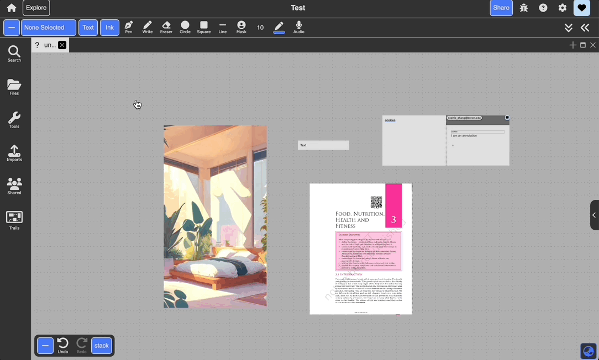

# Views

Views are the different ways that you can view a collection of documents. Dash supports four views in `novice mode`, and many additional views in `developer mode`. The most essential views that dash supports include:

| View       | Description                                                                                                         |
| :--------- | :------------------------------------------------------------------------------------------------------------------ |
| Freeform   | Unbounded 2D space in the form of a canvas. This is Dash’s primary view                                             |
| Schema     | Manipulating documents via key-value pairs and maintaining structured viewing and sorting of data                   |
| Stack      | Categorizing documents by specified keys while maintaining a live preview of each document                          |
| Notetaking | Create multiple columns of documents, allowing you to take notes in one column while having your content in others. |

## Changing Views

Use the dropdown in the top toolbar to change between views. If you don't see the dropdown or see a document-specific toolbar like image or text, click a blank area of the main view to invoke the view dropdown.

{:.img}

<!--
Dash is a hypermedia system that supports the following documents in the [latest verison of Dash](https://browndash.com/login).

    <iframe src="https://drive.google.com/file/d/1aepMLRz9_oGsYTG1ZY8n1uJDqL8bX3IX/preview" width="640" height="400" allow="autoplay" allowfullscreen="allowfullscreen"></iframe>

 -->
